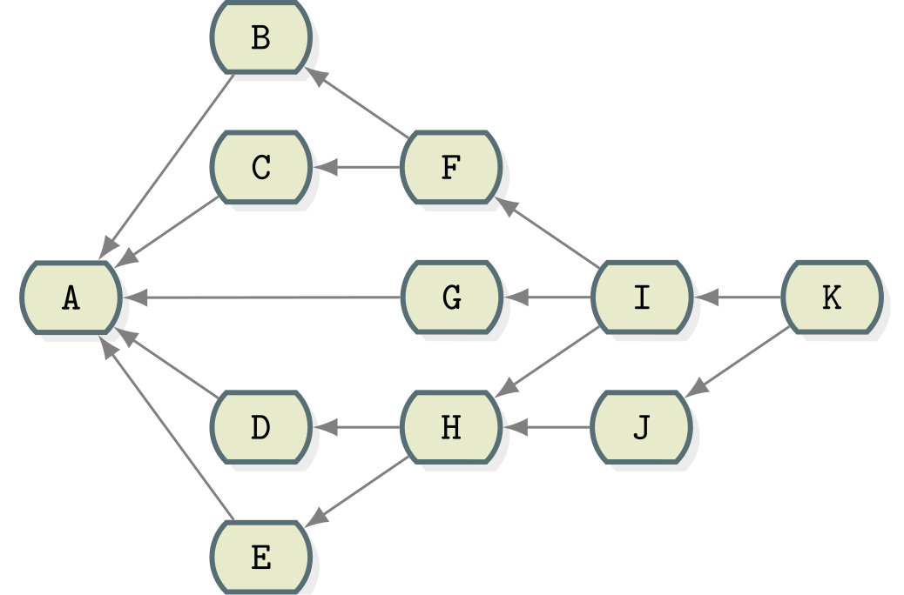

<div style="height:24.7cm; position: relative; border: 1px solid black;">
    <h1 style="position:absolute; top: 33%; width:100%; text-align: center;">{Titre-Formation}</h1>
    <h1 style="position:absolute; top: 50%; width:100%; text-align: center;">Travaux Pratiques</h1>
    
</div>
<div class="pb"></div>


## Présentation

L'agence de voyages Resanet a décidé de lancer le projet "resaroute", ce projet a pour but de créer une application unique d'aspiration d'informations sur les sites de transports publics tels celui de la SNCF.

Les premières idées du projet sont présentes et vont évoluer au fur et à mesure.
Le projet va aussi devoir débuter sous peu. Un système de versioning va devenir plus qu'important.

L'objectif principal est de mettre en place et gérer les premiers événements de ce dépôt Git.


<div class="pb"></div>


## TP1 – Installation et création du dépôt Git

### Objectif

Ce premier TP va nous permettre de mettre en place un dépôt Git en local.

L'objectif est d'installer et démarrer le projet resaroute avec les outils nécessaires.

### Installation de Git

- Télécharger l'installeur de Git pour la plateforme utilisée et lancer l'installation
  - Pour Windows, utiliser msysgit : http://msysgit.github.com/ ou Cygwin : http://cygwin.com/
  - Sous Linux utiliser le gestionnaire de dépôts de la distribution
  - Avec Mac OS X installer avec git-osx-installer : http://code.google.com/p/git-osx-installer
- Afin de vérifier que l'environnement est installé utiliser la commande `git --version`

### Première configuration

- Avant de commencer avec le projet en lui-même il est important d'avoir certains éléments de configuration prêts
  - Configurer le nom et l'adresse e-mail de l'utilisateur principal
  - Configurer l'éditeur qui sera utilisé
    - Sous Mac OS/Linux : vi/vim, emacs ou nano
    - Sous Windows : notepad.exe ou notepad++.exe (attention aux espaces et aux antislash : utiliser des guillemets autour du chemin ainsi que des simples slash)
  - Configurer l'affichage en couleur en définissant la clé de configuration `color.ui` à `auto`

### Initialisation du projet

- Initialiser le projet resaroute avec la commande `git init`.


<div class="pb"></div>


## TP2 – Démarrage du projet

### Objectif

Le projet étant démarré, les premières idées vont être versionnées pour voir leur évolution et permettre de retracer les différentes idées.

### Première idée

- Créer à la racine un fichier **README.txt** contenant une description du projet (texte de présentation de ce TP) ainsi que **TODO.txt** contenant quelques idées :

```
Sites à scanner :
 - voyages-sncf.com
 - ryanair.com
 - eurolines.fr
 - eurostar.com

Couleurs de l'application :
Rouge sur fond vert

Titre de l'application :
Resaspi
```

- Indexer les fichiers **TODO.txt** et **README.txt**
- Grâce à la commande `git status` vérifier que les deux fichiers sont à être commités

### Validation des idées

- Afin de séparer l'ajout des deux fichiers dans deux commits différents, supprimer **TODO.txt** de l'index actuel puis commiter
  - Titre : "Initialisation du projet"
  - Contenu : "Ajout du fichier README.txt décrivant le projet"
- Puis re-indexer le fichier **TODO.txt** et commiter
  - Titre : "Définition des tâches à effectuer"
  - Contenu : "Création du fichier TODO.txt listant toutes les tâches actuellement prévues pour le projet"
- Vérifier que les deux fichiers sont biens commités dans deux commits différents avec la commande `git log`

### Retour vers le premier commit

- Afin de préparer la création des futures branches, dont une pour gérer la todolist, remontez au commit initial avec la commande `git checkout` et le hash du premier commit qui est accessible depuis le log (attention à l'ordre des commits affichés par la commande `git log`)
- Lister le contenu du dossier


<div class="pb"></div>


## TP3 – Débranches, des branches

### Objectif

Pour gérer le projet de façon propre, de nouvelles branches permettant de gérer le **TODO.txt** et le début du projet vont devoir être créées.

### 1. La branche *master*

- Regarder l'état de l'arbre des commits avec la commande `git log --graph --oneline --decorate --all`
- Faire revenir la branche *master* au commit actuel avec la commande `git branch -f`
- Regarder l'état des branches avec un `git branch` + un `git log --graph --oneline --decorate --all`. Expliquer.

### 2. La branche *todo*

- Créer depuis la position actuelle la branche *todo*, qui, comme son nom l'indique, servira à gérer le contenu du fichier **TODO.txt**
- Regarder l'état des branches avec un `git branch`. Expliquer.
- Se positionner sur la branche *todo*
- Créer le nouveau fichier **TODO.txt** :

```
Sites à scanner :
 - voyages-sncf.com
 - ryanair.com
 - eurolines.fr
 - eurostar.com

Langage de programmation de l'application :
Java

Serveur d'application :
tomcat 7

Couleurs de l'application :
Rouge sur fond vert

Technologies web :
 - Servlet & JSP
 - Wicket
 - Struts2
```

- Versionner **TODO.txt** et commiter
  - Titre : "Création de la todolist des développeurs"
  - Contenu : "Création de la todolist contenant les choix techniques de l'équipe technique"
- Ajouter 'JSF' comme nouvelle technologie web et commiter
  - Titre : "Ajout de JSF dans les technologies web"
  - Contenu : "JSF est une technologie web envisagée pour le projet"
- Grâce à la commande `git log` vérifier que les deux commits sont bien présents dans un graphe reprenant tous les commits existants

### 3. Premières sources

Pour débuter le projet il a été décidé de commencer à partir du premier commit une nouvelle branche *interface-web*

- Créer la nouvelle branche *interface-web* partant du premier commit (celui du **README.txt**) tout en se positionnant sur la nouvelle branche
- Dans cette branche, créer un nouveau dossier **src** contenant la page **index.html** :

```html
<html>
  <body>
    <h1>Resanet - Des voyages nets</h1>
    <p>Transports utilisables : train, avion ou bateau</p>
  </body>
</html>
```

- Ajouter ce contenu et commiter
  - Titre : "Création de l'index"
  - Contenu : "Création de la page d'index de l'application"
- Modifier le HTML pour ajouter un titre avec la balise `<head>` dans le document puis commiter
- Ajouter la ligne "Le site est disponible à l'adresse http://www.resanet.com/resaroute/" dans le fichier **README.txt** puis commiter
- Vérifier que le commit se soit bien passé en affichant la liste de tous les commits existants

### 4. La fusion

- Regarder l'état des branches avec un `git log --graph --oneline --decorate --all`
- Se positionner sur la branche *master* et y fusionner la branche *todo* grâce à la commande `git merge`
  - Expliquer le résultat du merge visible avec un `git log --graph --oneline --decorate --all`
- Sur la branche *master*, ajouter la ligne "Les tâches techniques à effectuer sont dans le fichier TODO.txt" dans le fichier **README.txt** puis commiter
- Fusionner la branche *interface-web* dans *master*
  - Gérer les conflits de version
  - Expliquer le résultat du merge
- Afficher le graphe des commits pour constater le résultat

### 5. Copies de commits

- Créer une branche *java* à partir de la branche *master* tout en se positionnant sur la branche
- Une équipe de développeurs a commencé le développement de l'application et a créé un fichier **src/java/Main.java**

```java
public class Launcher {

  public static void main(String... args) {
    System.out.println("Hello world");
  }

}
```

- Ajouter et commiter ce contenu
  - Titre : "Création du launcher de l'application"
  - Description : "Ajout de la classe Launcher, classe ayant la méthode main()"
- Ajouter dans le **TODO.txt** :
```
Application lourde :
Technologie Swing
```

- Ajouter et commiter ce contenu
  - Titre : "Ajouts dans la todolist"
  - Description : "Informations sur le projet de création d'application lourde"
- L'équipe se chargeant de gérer le fichier **TODO.txt** veut absolument récupérer ce dernier commit faisant des modifications sur la liste
  - Depuis la branche *todo* récupérer uniquement le commit ayant modifié le fichier **TODO.txt** dans la branche *java*
  - Utiliser `git cherry-pick`

### 6. Déplacement et réarrangements

- Créer la branche *jsp* partant de la branche *java*
- Le développeur en charge de la partie web débute quelques pages JSP dans la nouvelle branche *jsp*, en particulier ajoute le fichier **src/jsp/index.jsp**

```jsp
<html>
  <head><title><%=transport.getId()%></title></head>
  <body>
    <h1><%=transport.getId()%> - <%=transport.getType()%></h1>
    <p><%=transport.getDescription()%></p>
  </body>
</html>
```

- Créer et commiter ce fichier
  - Définir un titre et une description pertinente
- Après observation d'une erreur, une correction est apportée à ce fichier, et `getDescription()` est changé en `getFullDescription()`
  - Effectuer ces modifications et les commiter
  - Définir un titre et une description pertinents
- L'équipe en charge de l'interface web, fait remarquer judicieusement qu'il serait plus sage de baser le travail de *jsp* sur *interface-web* plutôt que *java*
  - Déplacer tous les commits faits par *jsp*, mais pas *java*, au-dessus de la branche *interface-web* avec l'aide de `git rebase`

### 7. Du travail de taxinomiste

- Se repositionner sur la branche *todo*
- Pour pouvoir accéder plus rapidement à certaines étapes cruciales du projet, il a été décidé d'associer certains commits avec un nom "simple"
  - Créer le tag simple *first-meeting* sur le tout premier commit du fichier **TODO.txt** (trouvé en regardant les logs du fichier **TODO.txt**)
- Se positionner sur la branche *master*
- Sur le commit ajoutant la référence du **TODO.txt** dans le **README.txt** (trouvé en effectuant un `git blame` du fichier **README.txt**), ajouter un tag annoté :
  - Titre : 'second-meeting'
  - Message : "Après la seconde réunion, la décision de valider la todolist a été prise"


<div class="pb"></div>


## TP4 – Références et relations



- Les commits ont été faits dans l'ordre alphabétique (B est fait après A)
- Les merges sont faits par ordre alphabétique (I est un merge dans l'ordre de F G et H)

- Quels est le commit sélectionné par
  - `J^`
  - `F^`
  - `G~`
  - `I^2`
  - `K~3`
  - `K~^3^2`

- Quelle serait la/les notations de
  - I par rapport à K
  - J par rapport à K
  - A par rapport à H
  - C par rapport à K
  - D par rapport à I
  - J par rapport à H

- Quels sont les commits sélectionnés par les ensembles
  - `F`
  - `F H`
  - `^H I`
  - `I...J`
  - `I^@`
  - `K^!`


<div class="pb"></div>


## TP5 – Les accès distants

- Si l'accès à internet est disponible :
  - Créer un compte sur https://github.com
  - Créer un repository *formation-git-tp* sur le site, son adresse sera l'"origin" (https://github.com/YOUR_GITHUB_USERNAME/formation-git-tp.git)
  - L'adresse https://github.com/Zenika/formation-git-tp.git sera "upstream"
- S'il n'y a pas accès à internet :
  - Créer un projet *origin* avec la commande `git init --bare origin.git`
  - Le formateur donnera son adresse IP et l'accès à un projet Git "upstream"
- Ajouter respectivement les dépôts distants
  - *upstream* – fourni par le formateur
  - *origin* – créé précédemment
- Pour les deux dépôts récupérer le contenu actuel avec `git fetch` (en cas de problème de certificat SSL, configurer la variable d'environnement `GIT_SSL_NO_VERIFY` à `true`)
- Envoyer le contenu de la branche *master* sur *origin* avec la commande `git push`
- Envoyer tous les tags et toutes les branches restantes sur *origin*
- Supprimer la branche *todo* sur *origin*
- Récupérer la branche *design* depuis *upstream*, merger dans *master* (on devra utiliser l'option `--allow-unrelated-histories` car les 2 branches à merger n'ont pas d'historique commun) et mettre à jour *master* dans le dépôt *origin*


<div class="pb"></div>


## TP6 – Configuration personnalisée

- Définir les alias `st`, `ci` et `co` respectivement pour les commandes `status`, `commit` et `checkout`
- Dans le projet actuel, ignorer certains fichiers
  - Ceux commençant par un point
  - Sauf **.gitignore** et **.project**
  - Le dossier **tests** situé à la racine
  - Le fichier **temp.txt** à la racine
