<div style="height:24.7cm; position: relative; border: 1px solid black;">
    <h1 style="position:absolute; top: 33%; width:100%; text-align: center;">{Titre-Formation}</h1>
    <h1 style="position:absolute; top: 50%; width:100%; text-align: center;">Travaux Pratiques</h1>
    
</div>
<div class="pb"></div>


<div class="pb"></div>


## TP1 – HDFS

### Objectif

Ce premier TP va nous permettre de prendre en main HDFS.

Afin de développer plus rapidement et se donner une idée de ce qu'est un cluster data, nous allons travailler avec un lab.

Celui-ci est à l'adresse suivante : [https://labs.itversity.com/user/lab](https://labs.itversity.com/user/lab).

Il s'agit d'un cluster partagé par beaucoup d'inconnus du monde entier.
Il contient plusieurs outils data.

### Accès au lab

- Se rendre sur [https://labs.itversity.com/user/lab](https://labs.itversity.com/user/lab).


- Cliquer sur *login* et se connecter


- Choisir l'option *Exclusive Labs*
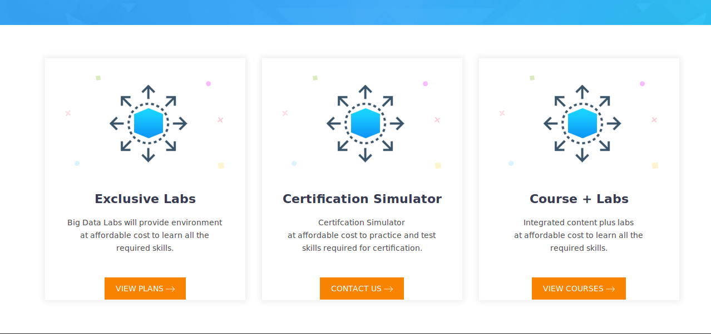

- Choisir l'option *Monthly*
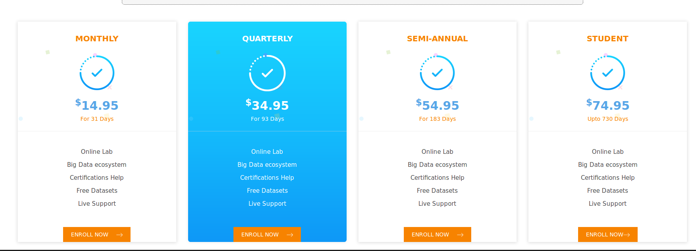

- Valider le paiement 
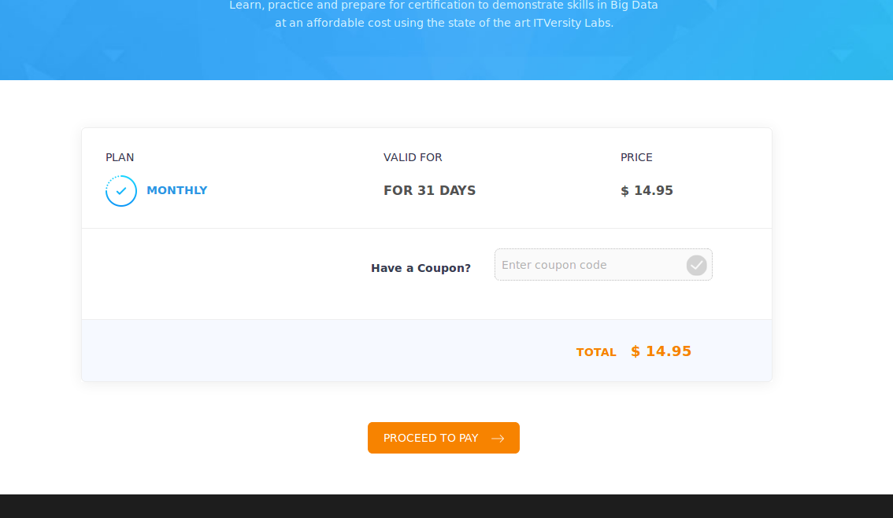

- Payer avec la carte Zenika
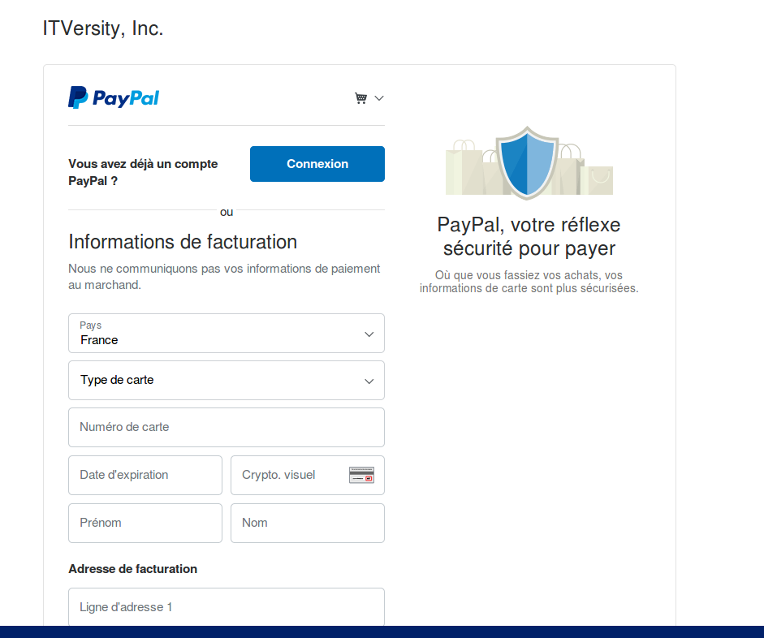

- M'envoyer le reçu que vous avez par mail à *nastasia.saby@zenika.com*

### Se connecter au lab

- Se rendre sur cette adresse : [https://labs.itversity.com/user/lab](https://labs.itversity.com/user/lab)
- S'y connecter
- Cliquer sur console
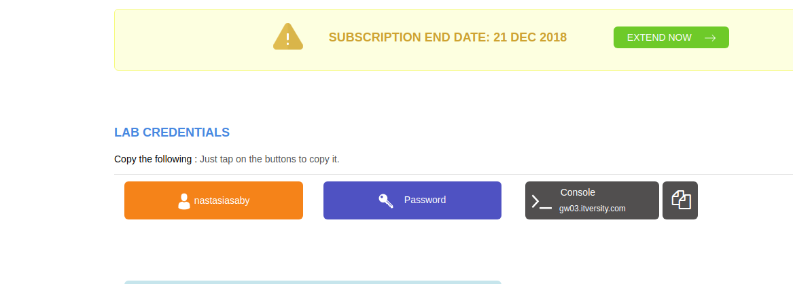
- La console s'ouvre
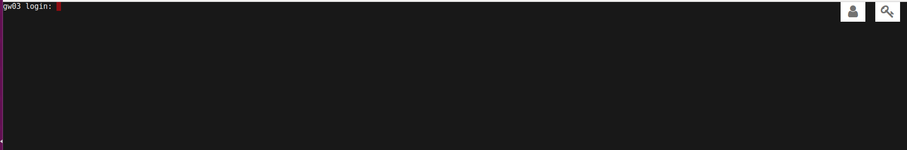
- Cliquer sur l'icône *personnage* puis Ctrl + V pour entrer votre login
- Faire *entrée*
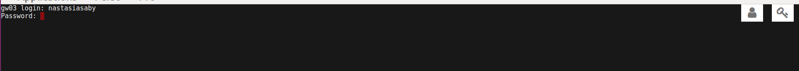
- Cliquer sur l'icône *clef* puis Ctrl + V pour entre votre mot de passe
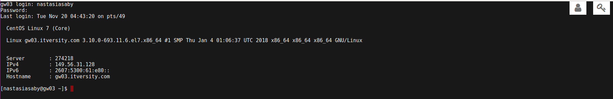
- Faire *entrée*

<div class="pb"></div>

### Lancer des commandes HDFS dans votre environnement HDFS

- Faire un *hdfs dfs -ls*, un *hdfs dfs -ls /user* ainsi qu'un *hdfs dfs -ls /user/votrelogin* et noter la différence

- Créer un fichier en tapant la commande *echo hello world ! > hello.txt*

- Si vous faîtes *ls* vous devriez voir votre fichier

- Créer un dossier *tp1* HDFS dans */user/votrelogin*

- Si vous faîtes *hdfs dfs -ls /user/votrelogin* ou *hdfs dfs -ls*, vous devriez le voir apparaître

- Mettre le fichier *hello.txt* dans */user/votrelogin/tp1*

- Si vous faîtes *hdfs dfs -ls /user/votrelogin/tp1* ou *hdfs dfs -ls tp1*, vous devriez le voir apparaître


### Lancer des commandes HDFS dans un autre environnement que le vôtre

- Lancer la commande *hdfs dfs -ls /* et noter qu'il y a d'autres dossiers que *user*. 
Plusieurs servent au bon fonctionnement d'outils présents sur le cluster comme Spark par exemple.

Il y a aussi un dossier */public*. C'est là que nous pouvons trouver des fichiers d'exemple.

- Afficher le contenu du dossier */public/retail_db_json/products*

Il y a deux fichiers : *SUCCESS* est un fichier qui sert à la machine. Le deuxième fichier contient un réel contenu.

- Afficher la fin du fichier */public/retail_db_json/products/part-r-00000-158b7037-4a23-47e6-8cb3-8cbf878beff7*

- Afficher l'entièreté du fichier */public/retail_db_json/products/part-r-00000-158b7037-4a23-47e6-8cb3-8cbf878beff7*

- Récupérer chez vous le fichier */public/retail_db_json/products/part-r-00000-158b7037-4a23-47e6-8cb3-8cbf878beff7* sous le nom de *products.json*


### Comprendre HDFS de l'intérieur

- Se rendre sur [http://nn01.itversity.com:50070/dfshealth.html#tab-overview](http://nn01.itversity.com:50070/dfshealth.html#tab-overview)

Nous sommes là dans les informations du NameNode HDFS présentées de manière graphique.

- Cliquer sur *Utilities/Browse the file system*
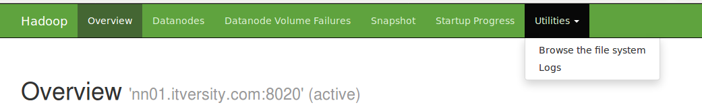

Par là, on peut naviguer en mode graphique dans les fichiers et dossiers HDFS 
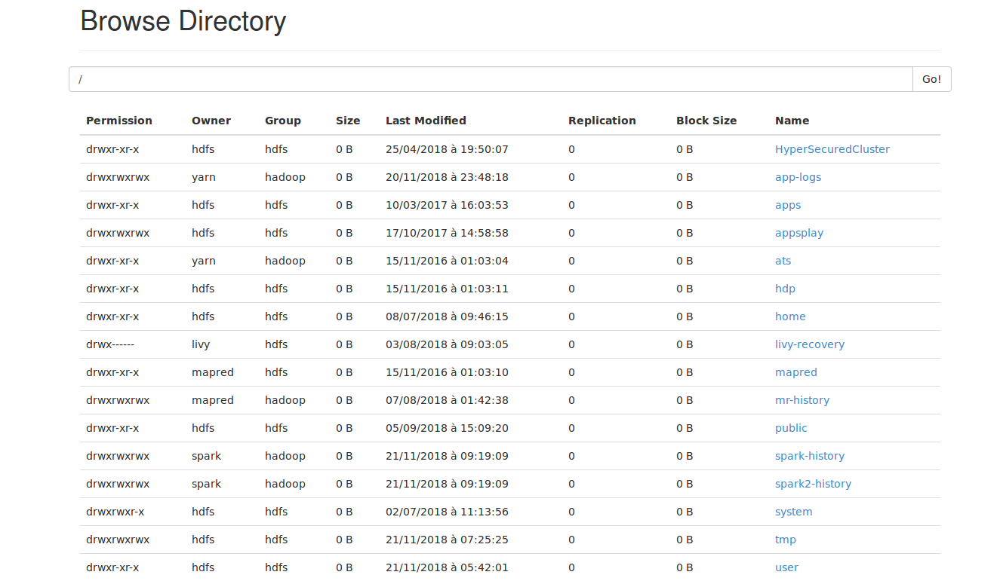

- Se rendre dans */public/retail_db_json/products*

- Cliquer sur *part-r-00000-158b7037-4a23-47e6-8cb3-8cbf878beff7*

Une popup s'affiche.
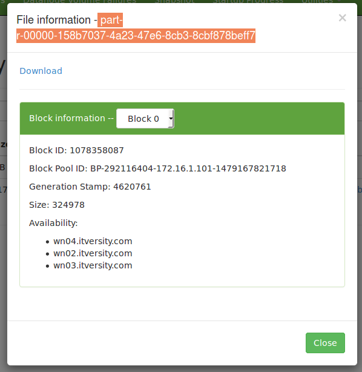

Les informations en dessous de *Availability* nous disent sur quels noeuds est stocké physiquement le fichier.

*Block information* nous donne le nombre de blocks pour ce fichier. 
A noter qu'ici, il n'y en a qu'un.

Nous avons donc un fichier qui n'est qu'en un block répliqué sur 3 noeuds différents.

## TP2 – Prendre en main Ambari

### Objectif

Ambari est le service de Hortonworks qui nous permet d'installer, maintenir, gérer et comprendre notre cluster data. 

### S'y connecter

- Se rendre sur la page [https://labs.itversity.com/user/lab](https://labs.itversity.com/user/lab)
- Cliquer sur *Ambari*
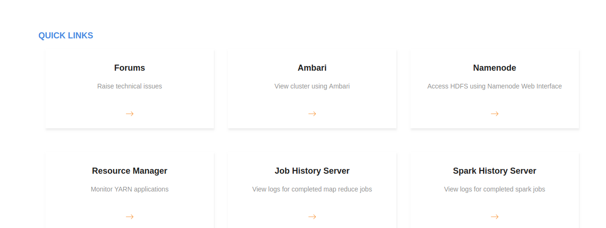

- Utiliser les identifiants du lab pour se connecter
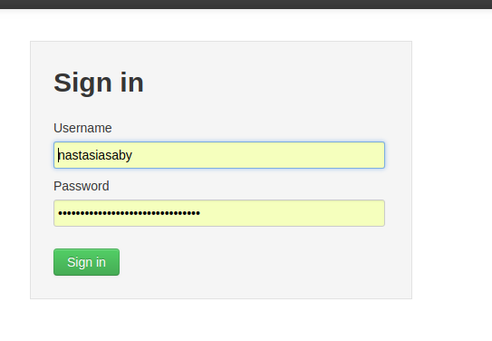

- Repérer sur la gauche le nombre d'outils installés
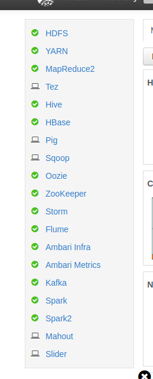

- Repérer les métriques
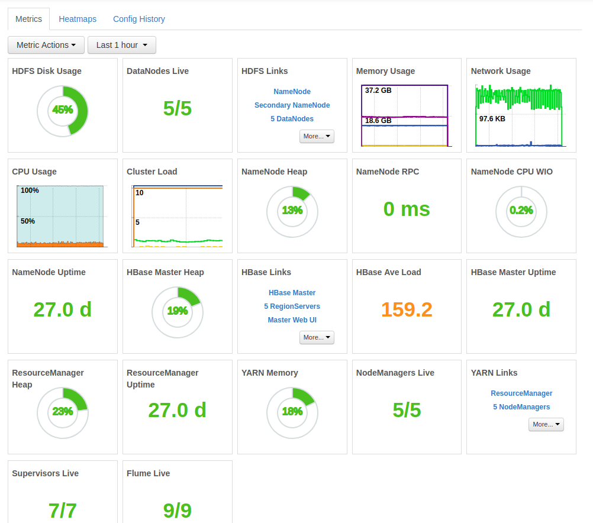

### Comprendre le système de *Hosts*

- Cliquer sur *Hosts*

Nous avons là la liste des machines avec leur nom et des informations dessus.
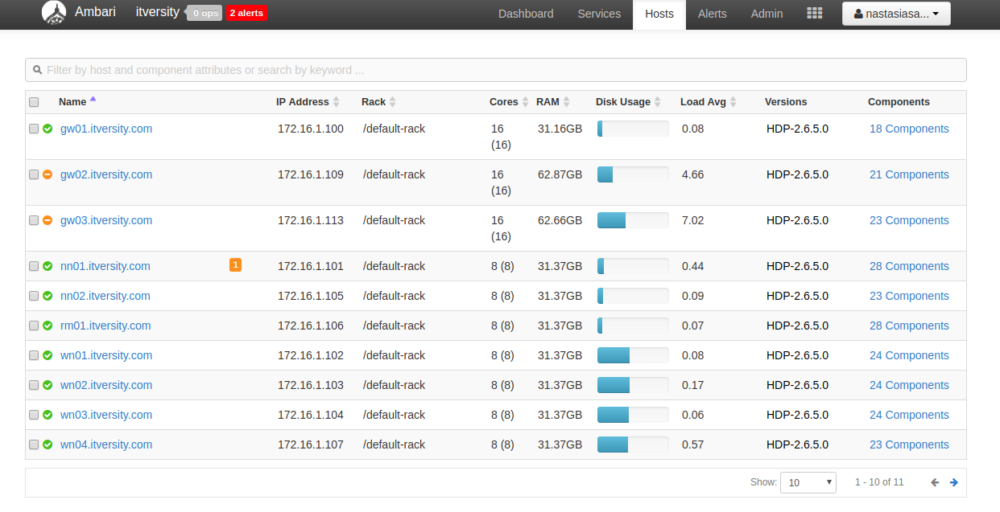

- Quand on clique sur les liens dans la colonne *Components*
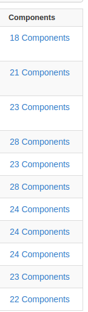
on obtient la liste des éléments installés sur la machine 
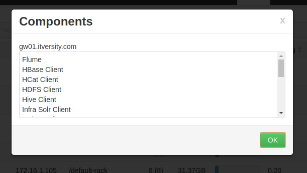

- Combien y a-t-il de machines en tout dans notre cluster ?

- Combien y a-t-il de racks ?

- Sur quelle machine le NameNode HDFS (master) est installé ?

- Sur quelle machine le ResourceManager YARN (master) est installé ?

- Sur quelles machines sont installées les DataNode HDFS (workers) ?

- Sur quelles machines sont installées les NodeManager YARN (workers) ?


### Comprendre le système de *Services*

- Cliquer sur *Services* et repérer la liste des services

- Choisir *HDFS*

- Cliquer sur *Quick Links* et choisir *NameNode UI*
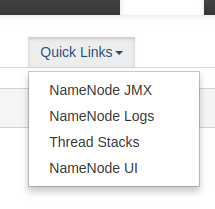

La page qui s'ouvre est celle de tout à l'heure.
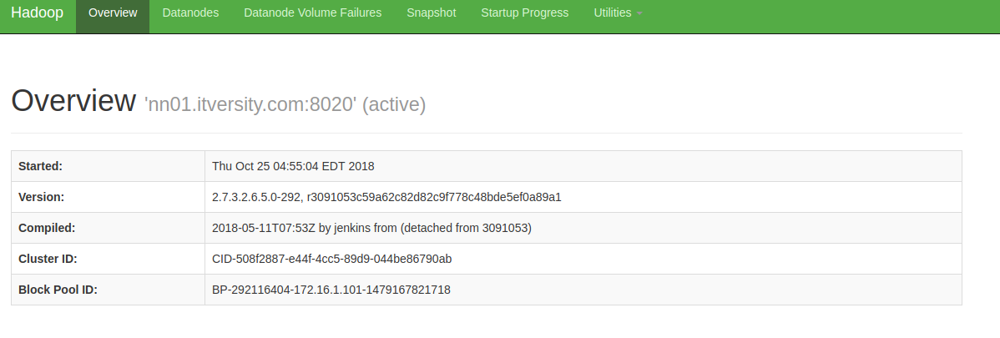
Ambari permet d'accéder à toutes les interfaces graphiques des services.


<div class="pb"></div>


## TP3 – Lire un fichier avec Spark

### Objectif

Avec cet exercice, nous allons commencer à prendre en main Spark.
Pour cela, nous n'allons pas créer un vrai programme, mais nous servir du *spark-shell*.

Le *spark-shell* est un REPL qui inclut du Scala et du Spark.

A noter qu'il existe aussi *pySpark* qui est un REPL qui inclut du Python et du Spark.

Etant donnée que Spark est écrit en Scala, qu'il n'y a pas de REPL Java pour Spark et que Scala est le langage le plus utilisé avec Spark, je vous propose de nous concentrer sur *spark-shell*.

### Se connecter au lab

- Se rendre sur cette adresse : [https://labs.itversity.com/user/lab](https://labs.itversity.com/user/lab)
- S'y connecter
- Cliquer sur console

- La console s'ouvre

- Cliquer sur l'icône *personnage* puis Ctrl + V pour entrer votre login
- Faire *entrée*

- Cliquer sur l'icône *clef* puis Ctrl + V pour entre votre mot de passe

- Faire *entrée*

### Lancer *spark-shell*

Il y a deux versions de Spark qui cohabite sur le cluster : Spark 1 et Spark 2.

Si on tape seulement *spark-shell*, on aura Spark1. Mais nous voulons la dernière version de Spark, la 2.

- Lancer la commande *export SPARK_MAJOR_VERSION=2*

- Lancer la commande *spark-shell --version* afin de vérifier que Spark 2 est bien configuré.

- Lancer la commande *spark-shell*

Les variables d'entrée de Spark sont déjà initialisées notamment la *SparkSession* qui est présente dans la variable *spark*.

### Lire un fichier en json

- Dans *spark-shell*, créer une variable *products* et y stocker le contenu HDFS de */public/retail_db_json/products*

Pour lire du *json* avec Spark, on fait ainsi :
```scala
val x = spark.read.json("path")
```

Vous n'avez pas besoin de préciser le fichier. Spark comprend qu'il y a quelque chose dans le dossier.
Le fichier *SUCCESS* sera ignoré.

- Afficher les 20 premières lignes de ce fichier en utilisant *show* dans *spark-shell* sur la variable *products*

- Afficher le schéma du fichier en utilisant *printSchema* dans *spark-shell* sur la variable *products*

<div class="pb"></div>


## TP4 – Effectuer des transformations avec Spark

- A partir de la variable *products*, on veut uniquement les prix de plus de 100.
De plus, on cherche seulement à afficher via *show* le *product_id* et le *product_name*.

Le résultat doit être ainsi :

```
+----------+--------------------+
|product_id|        product_name|
+----------+--------------------+
|         2|Under Armour Men'...|
|         5|Riddell Youth Rev...|
|         6|Jordan Men's VI R...|
|         8|Nike Men's Vapor ...|
|        10|Under Armour Men'...|
|        11|Fitness Gear 300 ...|
|        12|Under Armour Men'...|
|        14|Quik Shade Summit...|
|        16|Riddell Youth 360...|
|        17|Under Armour Men'...|
|        19|Nike Men's Finger...|
|        20|Under Armour Men'...|
|        23|Under Armour Men'...|
|        32|PUMA Men's evoPOW...|
|        35|adidas Brazuca 20...|
|        40|Quik Shade Summit...|
|        46|Quest 12' x 12' D...|
|        48|adidas Brazuca Fi...|
|        49|Diamondback Adult...|
|        52|Easton Mako Youth...|
+----------+--------------------+
only showing top 20 rows

```

- A partir de la variable *products*, on veut le prix maximum par categorie et le prix minimum par categorie accompagné de la *product_category_id*. 

Le résultat doit être ainsi :

```
+------------------+------------------+-------------------+
|max(product_price)|min(product_price)|product_category_id|
+------------------+------------------+-------------------+
|              90.0|              18.0|                 26|
|            199.99|              4.99|                 29|
|            189.99|               0.0|                 19|
|            299.99|             34.99|                 54|
|           1799.99|             21.99|                 22|
|            329.99|              14.0|                  7|
|            169.99|             34.99|                 34|
|             130.0|              34.0|                 50|
|            189.99|               0.0|                 57|
|            999.99|             19.99|                 32|
|            449.99|              99.0|                 43|
|            899.99|             79.99|                 31|
|            199.99|             19.99|                 39|
|            229.99|               0.0|                 25|
|            399.99|              14.0|                  6|
|             241.0|              22.0|                 58|
|            499.99|              28.0|                  9|
|              90.0|              18.0|                 27|
|            219.99|              28.0|                 51|
|            159.99|              9.99|                 56|
+------------------+------------------+-------------------+
only showing top 20 rows

```

- A partir de la variable *products*, on veut le prix maximum par categorie et le prix minimum par categorie accompagné de la *product_category_id*.
Il s'agit en plus de renommer le prix maximum par "max_price" et le prix minimum par "min_price".

Le résultat doit être ainsi :

```
+---------+---------+-------------------+
|max_price|min_price|product_category_id|
+---------+---------+-------------------+
|     90.0|     18.0|                 26|
|   199.99|     4.99|                 29|
|   189.99|      0.0|                 19|
|   299.99|    34.99|                 54|
|  1799.99|    21.99|                 22|
|   329.99|     14.0|                  7|
|   169.99|    34.99|                 34|
|    130.0|     34.0|                 50|
|   189.99|      0.0|                 57|
|   999.99|    19.99|                 32|
|   449.99|     99.0|                 43|
|   899.99|    79.99|                 31|
|   199.99|    19.99|                 39|
|   229.99|      0.0|                 25|
|   399.99|     14.0|                  6|
|    241.0|     22.0|                 58|
|   499.99|     28.0|                  9|
|     90.0|     18.0|                 27|
|   219.99|     28.0|                 51|
|   159.99|     9.99|                 56|
+---------+---------+-------------------+
only showing top 20 rows
```


<div class="pb"></div>


## TP5 – Ecrire un fichier avec Spark

- Enregistrer le dernier résultat en format parquet dans */user/votrelogin/tp5*
- Relire ce résultat parquet et l'afficher en console avec la fonction *show*


<div class="pb"></div>


## TP6 – Spark de bout en bout

- Lire le fichier json */public/retail_db_json/orders*
- Définir le nombre d'*order_id* en le renommant *count_order_id* par *order_status*
Le résultat quand on fait un *show* doit être ainsi : 

```
+--------------+---------------+
|count_order_id|   order_status|
+--------------+---------------+
|         15030|PENDING_PAYMENT|
|         22899|       COMPLETE|
|          3798|        ON_HOLD|
|           729| PAYMENT_REVIEW|
|          8275|     PROCESSING|
|          7556|         CLOSED|
|          1558|SUSPECTED_FRAUD|
|          7610|        PENDING|
|          1428|       CANCELED|
+--------------+---------------+
```

- Enregistrer le tout en parquet dans */user/votrelogin/tp6*
- Vous pouvez relire le résultat parquet et l'afficher en console avec la fonction *show*


<div class="pb"></div>


## TP6 – Hive

- Définir les alias `st`, `ci` et `co` respectivement pour les commandes `status`, `commit` et `checkout`
- Dans le projet actuel, ignorer certains fichiers
  - Ceux commençant par un point
  - Sauf **.gitignore** et **.project**
  - Le dossier **tests** situé à la racine
  - Le fichier **temp.txt** à la racine
  
  
## TP7 – Sqoop
