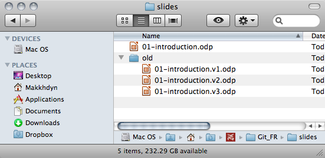
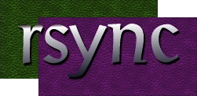
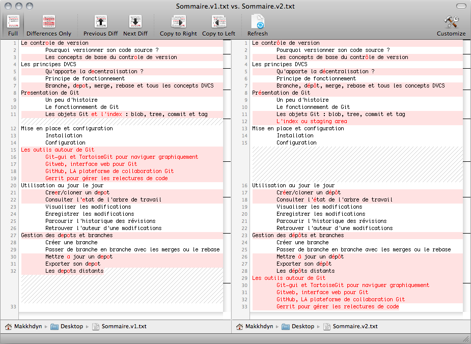
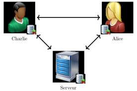
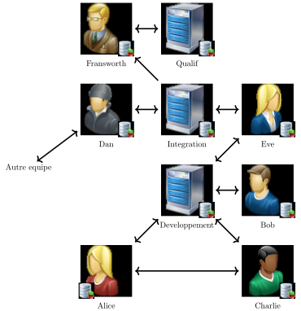

# Introduction

<!-- .slide: class="page-title" -->

## Plan

<!-- .slide: class="toc" -->

- **[Introduction](#/1)**
- [Fonctionnement de Git](#/2)
- [Utiliser Git en local](#/3)
- [Les références](#/4)
- [Utiliser Git en distant](#/5)
- [Configuration et outils externes](#/6)

Notes :

## Besoin ?

- Sauvegarde d'un contenu de façon à sécuriser les derniers ajouts/modifications
- Historisation des sauvegardes pour éviter la perte d'informations au cours du temps

- Cas standards d'utilisation
  - Développement d'une application
  - Écriture d'un rapport
  - Édition d'images
  - Bases de données

- Simplement toute activité résultant dans de la création ou suppression de données peut bénéficier de versioning

Notes :

## Les méthodes de base

- Besoin de sauvegarde important en informatique depuis toujours
  - Débute souvent avec un dossier rempli de fichiers copiés
    <figure>
      
    </figure>

  - Puis s'améliore avec des systèmes plus adaptés
    <figure class="inline">
      
      
      
    </figure>

Notes :

## Les avantages

- Conserver les données permet de voir l'évolution du contenu et les modifications apportées entre deux versions
  <figure>
    
  </figure>

- Ou simplement de revenir en arrière si l'on s'est trompé

Notes :

## Des solutions collaboratives

- Seulement il est courant de ne pas être seul sur un projet et d'avoir besoin d'échanger les versions de chacun puis les fusionner
  

- Pour ça des systèmes de versioning plus élaborés ont été adoptés
- Regroupés sous le terme de V.C.S pour *V*ersion *C*ontrol *S*ystem
- Plusieurs fonctionnements existent selon les solutions choisies
  - Le fonctionnement traditionnel **centralisé** ou CVCS
  - Le fonctionnement **distribué** ou DVCS

Notes :

## La notion de "commit"

- Quel que soit le type de versioning choisi, le fonctionnement est basé sur les *commits*
- Un commit est un regroupement de modifications (ajout/suppressions) auquel sont associés - à minima - un message, un auteur, une date
- Un commit doit se suffire à lui même :
  - Il doit laisser l'ensemble du contenu dans un état cohérent : le code doit compiler et les tests unitaires doivent passer
  - Le message associé doit indiquer le contenu des modifications
  - Il est trop souvent négligé : il permet pourtant de savoir ce qu'était censé faire le code à l'origine d'un bug par exemple

Notes :

## Centralized Version Control System

- Les CVCSs proposent de résoudre le problème de collaboration (ou concurrence) par un point central faisant le versioning
  

- Connexion au serveur pour effectuer des échanges
- Une modification est prise en compte lorsque les données sont poussées vers le serveur
- Cependant, une coupure de réseau signifie qu'il n'est plus possible de travailler
- Un crash du serveur (ou perte de données) est synonyme de catastrophe
  - Sauf si le serveur est lui même versionné...

Notes :

## CVCS - Les solutions

- Le principe de CVCS a connu une très forte popularité grâce à deux solutions open-source
  - CVS (*C*oncurrent *V*ersions *S*ystem)
    - Projet de la FSF depuis 1990, créé par Dick Grune en 1986 et basé (à l'origine) sur des scripts shell
    - La dernière mise à jour date de mai 2008
  - SVN (*S*ub*v*ersio*n*) 
    - Projet de l'ASF depuis 2009, créé en 2000 par l'entreprise CollabNet dans la vue de faire un successeur amélioré de CVS

Notes :

## Les défauts du CVCS

- L'idée d'un serveur central possède quelques défauts
  - Impossible de versionner sans tout rendre public
  - Tout le monde a le droit de commit (et peut tout casser)
  - Tendance à l'unique commit massif
  - Chaque tâche requiert une connexion vers le serveur
- Les CVCS sont pratiques, mais dans certains cas, simplement inadaptés
  - Un serveur central implique une confiance totale envers ce serveur
  - Dans une grande organisation, on se marche sur les pieds lors de commits

Notes :

## Distributed Version Control System

- Résolution des défauts de centralisation par une autre approche
  

- Chacun a son dépôt, et peut échanger avec tout le monde
- Un ou plusieurs dépôts servent à publier "publiquement" le contenu
- Chaque utilisateur est totalement autonome et peut faire ce qu'il souhaite dans son dépôt

Notes :

## DVCS - Les solutions

- L'idée de faire un réseau de pair à pair n'est pas neuve, mais ce sont en particulier trois solutions (open-source) qui sont à l'origine de la notoriété des DVCS
  <!-- .element: class="tight" -->
  - Bzr (Bazaar) 
    - Créé par Martin Pool en février 2005 pour Canonical. Version 0.0.1 sortie le 26 mars 2005
  - Hg (Mercurial) 
    - Créé par Matt Mackal le 19 avril 2005, en réponse à l'arrêt de l'offre gratuite de BitKeeper (un DVCS propriétaire)
  - git (Git) 
    - Créé par Linus Torvalds le 7 avril 2005, en réponse à l'arrêt de l'offre gratuite de BitKeeper (oui, le même)

> Mercurial does that too, but Git does it better... - Linus Torvalds

Notes :

## Avec qui échanger ?

- Le système centralisé donne l'impression qu'il faut un seul dépôt
  - C'est faux, il suffit d'avoir des dépôts de **confiance**
  - Il n'est pas obligatoire de faire confiance à tout le monde
  - Il n'est pas non plus obligatoire de ne faire confiance qu'à un seul dépôt

- On observe en général dans les structures utilisant des DVCSs deux types de dépôts :
  - Personnel/local : dans lequel l'utilisateur travaille
  - Public/online : dans lequel un ou plusieurs utilisateurs publient du contenu
- Il est possible d'avoir plusieurs workflows différents selon les besoins

Notes :

## Types de workflow possibles

Notes :

## Distributed !

- Les dépôts sont complètement distribués
  - La notion de dépôt central disparaît donc, remplacé par un/des dépôts de **confiance** : professeur Fransworth ne fait confiance qu'au dépôt d'intégration
  - Chacun est **indépendant**, mais peut travailler avec les autres : Charlie et Alice travaillent ensemble, et Bob n'est pas impacté
  - Les dépôts sont toujours **stables** : le travail de l'équipe de Dan n'est redescendu sur le serveur de développement qu'après intégration

- Si ce workflow ne convient pas, beaucoup d'autres peuvent être créés selon les besoins
  - Ex : workflow du kernel Linux

Notes :

## Comment échanger alors ?

- Une fois que Dan et Eve ont fait leur intégration, le but est de remonter l'information au professeur Fransworth
- Cette remontée d'information est une **pull request**
  - Chacun est libre, on ne peut pas "forcer" quelqu'un à récupérer du contenu
  - À la place, on lui propose de récupérer les dernières modifications, ce qu'il fera, ou pas
- Cette demande peut être faite via : 
  - un mail/téléphone/vive voix (le plus humain/commun)
  - un échange d'un fichier .patch contenant les modifications
  - un système automatisé
  - ce que l'on veut

Notes :

## Patchs "non-officiels"

- Charlie a fait une modification qu'il pense intéressante, mais il préfère que quelqu'un d'autre teste **avant** de rendre ça public
  - Alice peut directement récupérer ces modifications depuis le dépôt privé de Charlie
  - Alice peut appliquer ses propres patchs sur l'idée de Charlie pour réparer quelques soucis
  - Charlie récupère ensuite les patchs d'Alice pour publier le tout
- Faire des revues de contenu avant de publier est simple et permet d'éviter des erreurs
- Le dépôt n'est pas "pollué" par le travail en cours, tout est publié quand c'est prêt, et en attendant tout est **versionné**

Notes :

## One more thing

- Les dépôts sont 100% indépendants
  - Ils doivent donc tous contenir **toutes** les informations
  - L'historique des commits, les logs, tout est disponible en local

- La **première** copie peut être longue (il faut tout récupérer)
- Le travail en local sera **instantané**, récupérer des logs, revenir sur des versions précédentes prend moins d'une seconde

Notes :

## En bref

- Les DVCSs ont donc l'avantage d'être indépendants
  - on peut versionner du travail pas tout à fait fini
  - il est facile de faire un "fork" et de créer son propre projet (pratique dans l'open-source)
  - le travail est fait en local, pas besoin de connexion réseau pour toutes les opérations
  - chaque dépôt contient toutes les informations, il est impossible de perdre des données propagées
  - l'échange des modifications suit un workflow adapté/adaptable
- Et aucune de ces capacités n'est spécifique à Git !

Notes :

<!-- .slide: class="page-questions" -->
