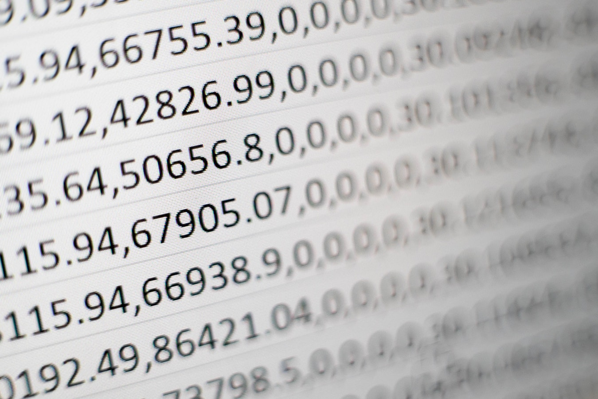
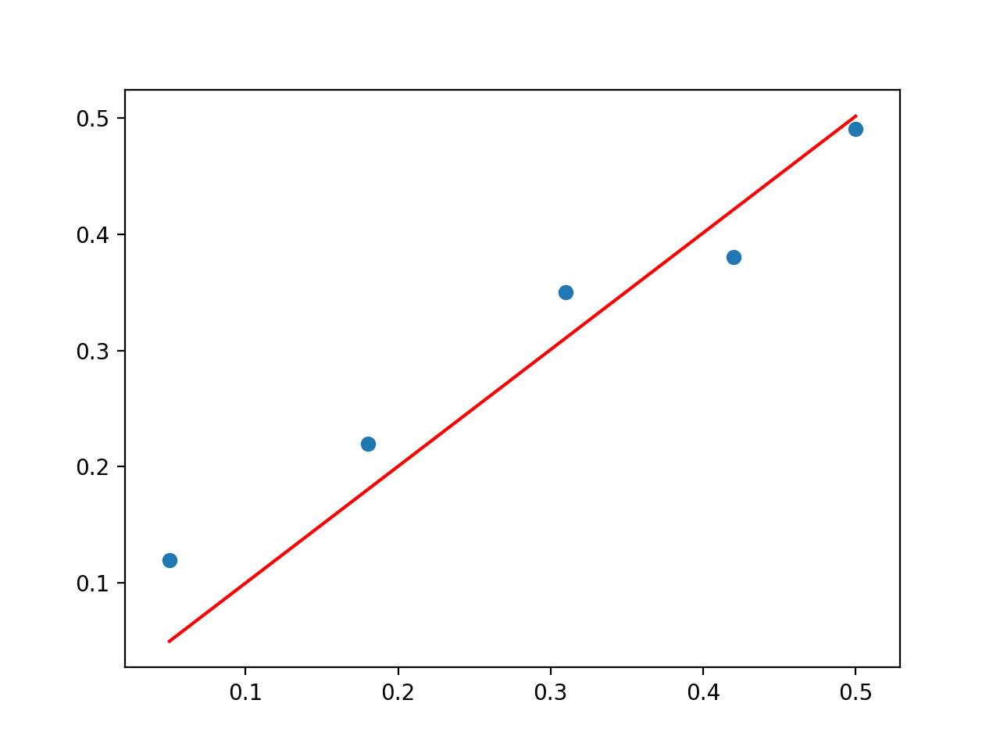
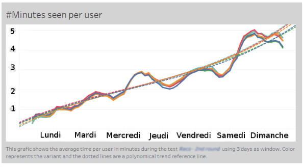

# Introduction

<!-- .slide: class="page-title" -->

## Plan

<!-- .slide: class="toc" -->

- **[Introduction](#/1)**
- [Système distribué](#/2)
- [Cluster et gestionnaires de cluster](#/3)
- [Calcul distribué : Spark en action](#/4)
- [Tour des outils du monde de la data](#/5)
- [RGPD](#/6)

## Introduction

- **Qu'est-ce que le Big Data ?**
- Cas d'usage du Big Data
- La data science
- Dataviz
- Les métiers du Big Data

# Qu'est-ce que le Big Data ?

<!-- .slide: class="page-title" -->

## De la donnée au Big Data

- Il y a toujours eu des données.

  - La preuve : les bases de données, les fichiers Excel
  - Des spécialistes : administrateur de bases de données
  - Des domaines : Business Intelligence

## De la donnée au Big Data

- Les données changent en terme de quantité.

  - Par jour :
    - Google Translate traduit plus de 140 milliards de mots
    - 1 petabyte de vidéo est ajouté à YouTube

  - Par minute :
    - 2,4 millions de recherches sur Google
    - 347,222 nouveaux tweets postés par Twitter

##  De la donnée au Big Data

- Les données changent en terme de variété

  - Logs serveur
  - Réseaux sociaux
  - Transactions financières
  - Email et messages texte

## La donnée a de la valeur

- Détection de fraudes
- Recommendations de produits
- Analyses marketing
- Prédictions
- Science

## Les définitions du Big Data

> > Le big data, littéralement « grosses données », ou mégadonnées, parfois appelées données massives, désigne des ensembles de données devenus si volumineux qu'ils dépassent l'intuition et les capacités humaines d'analyse et même celles des outils informatiques classiques de gestion de base de données ou de l'information (*Wikipedia*)

## Les définitions du Big Data

> > Une visualisation des données créée par IBM montre que les big data sur les modifications de Wikipedia par le robot Pearle ont plus de signification lorsqu'elles sont mises en valeur par des couleurs et des localisations.
Le big data, littéralement « grosses données », ou mégadonnées (recommandé), parfois appelées données massives, désigne des ensembles de données devenus si volumineux qu'ils dépassent l'intuition et les capacités humaines d'analyse et même celles des outils informatiques classiques de gestion de base de données ou de l'information (*Larousse*)

## Les concepts-sous-jacents

- NoSQL
- Machine Learning
- Open Data
- Modèle distribué
- Temps réel

## Avancées technologiques

- Stockage
- Réseaux
- Puissance

## Les 3 V de Gartner

- Une manière de définir simplement le Big Data
- Autour de 3 axes

## Volume

<figure>
      
</figure>

 

*=> Difficile à gérer dans une base donnée classique*

## Variété

<figure>
      
</figure>

## Vélocité

Production et collecte en temps réel, semi-réel ou limité
 
 
<figure>
      
</figure>

## Les 4 V avec la véracité

- Erreur dans les données
- Problème des données déclaratives
- Faux profils

## Les 5 V avec la valeur

<figure>
      
</figure>

 
 *\#infobésité #tri*

## Objectifs d'un projet Big Data

- Prise de décision
- Connaissance client
- Réduction des coûts

## L'entreprise a-t-elle besoin de Big Data ?

- Base de données explosives
- Sources de données non structurées
- Information en temps réel
- Peu d'analyse de données
- De la valeur à tirer des données

## Méthodologie itérative

- Agilité aussi dans la data
- Incréments pour sortir de la valeur rapidement

 
<figure>
      
</figure>

## Equipe pluridisciplinaire

- Utilisateurs finaux
- Product owners
- Développeurs
- Scientifiques

## Sources de données internes

- Facturation
- CRM
- ERP
- Processus

## Sources de données externes

- Autres sites
- Partenaires
- Public
- Réseaux sociaux

## Open Data

<figure>
      
</figure>

## Données croisées

<figure>
      
</figure>

## Introduction

- Qu'est-ce que le Big Data ?
- **Cas d'usage du Big Data**
- La data science
- Dataviz
- Les métiers du Big Data

# Cas d'usage du Big Data

<!-- .slide: class="page-title" -->

## Connaître ses utilisateurs
- Prendre de meilleures décisions
- Faire évoluer le service
- AB Testing
- Personnaliser

## Prendre de meilleures décisions avec des dashboards

<figure>
      
</figure>

## Décisions éclairées

<figure>
      
</figure>

## Faire évoluer le service

- Meilleure connaissance utilisateurs
- Meilleures idées

## AB Testing

- Faire valider ses idées scientifiquement

 
<figure>
      
</figure>

## Personnaliser

- Segmentation
- Adaptation aux segments
  
<figure>
      
</figure>

## Savoir comment vendre son produit

- Connaître ses concurrents
- Connaître les réactions clients/utilisateurs
- Connaître le marché
- S'y adapter

## Connaître ses concurrents

- Statistiques de prix selon caractéristiques
  
<figure>
      
</figure>

## Connaître les réactions clients/utilisateurs

- Etude des réseaux sociaux
  
<figure>
      
</figure>

## Connaître le marché

- Segments marché
- Ce qui se vent
- Phase de vie produit

## Introduction

- Qu'est-ce que le Big Data ?
- Cas d'usage du Big Data
- **La data science**
- Dataviz
- Les métiers du Big Data

# La data science

<!-- .slide: class="page-title" -->

## Définition

> > 
En termes généraux, la science des données est l'extraction de connaissance d'ensembles de données.

> > 
Elle emploie des techniques et des théories tirées de plusieurs autres domaines plus larges des mathématiques, la statistique principalement, la théorie de l'information et la technologie de l'information, etc (*Wikipedia*)

## Exemple avec la validation statistiques sur AB Testing

- Statistiques fréquentistes
- Statistiques bayésiennes

## Machine learning

- Apprendre sans être explicitement programmé
- Branche de l'intelligence artificelle

  
<figure>
      
</figure>

## Machine learning supervisé

- Avec un modèle
- Phase d'apprentissage -> Phase d'utilisation
- Ex : un filtre antispam

 
<figure>
      
</figure>

## Régression linéaire par exemple

<figure>
      
</figure>

## Machine learning non supervisé
- Pas de modèle
- Système de clustering, regroupement
- Ex : si deux fleurs ont la même forme => même plante

 
<figure>
      
</figure>

## Ses applications en général
- Détection de fraude
- Reconnaissance faciale
- Diagnostic médical

## Introduction

- Qu'est-ce que le Big Data ?
- Cas d'usage du Big Data
- La data science
- **Dataviz**
- Les métiers du Big Data

# Dataviz

<!-- .slide: class="page-title" -->

## Définition

> > 
Une représentation graphique de données statistiques ou visualisation de données statistiques est un résumé visuel des données statistiques chiffrées.

> > Elle permet en un seul coup d'œil d'en saisir la tendance générale (*Wikipedia*).

## Exemple de la vie courante

<figure>
      
</figure>

## Exemple professionel

<figure>
      
</figure>

## Quelques chiffres
- 90 % de l'information arrivant au cerveau est visuelle
- Images traitées 60 000 fois plus vite que le texte

## Les outils
- QlikView
- Tableau
- Superset
- D3.js

## Introduction

- Qu'est-ce que le Big Data ?
- Cas d'usage du Big Data
- La data science
- Dataviz
- **Les métiers du Big Data**

# Les métiers du Big Data

<!-- .slide: class="page-title" -->

## Data ingénieur
- Développeur
- Hadoop, Spark, Kafka, Flink, NoSQL, TensorFlow
- Scala, Python, Java, R

## Data scientiste
- Définit des modèles pour faire parler les données
- SQL, R, Python
- Data science, machine learning

## Data analyste
- Explorateur des données
- Capacité d'analyse
- SQL

## OPS Data
- Plateformes Big Data
- Cluster

## Développeur dataviz
- Data visualisation
- Plus ou moins technique

## Product owner, product manager, etc
- Spécialisé data

<!-- .slide: class="page-questions" -->
