# Fonctionnement de Git

<!-- .slide: class="page-title" -->


## Plan

<!-- .slide: class="toc" -->

- [Introduction](#/1)
- **[Fonctionnement de Git](#/2)**
- [Utiliser Git en local](#/3)
- [Les références](#/4)
- [Utiliser Git en distant](#/5)
- [Configuration et outils externes](#/6)

Notes :


## Historique

- Le kernel Linux était versionné sur le DVCS propriétaire BitKeeper
  - Après des années de trolls/flames, BitKeeper et Linux ont préféré se séparer, l'annonce officielle date du 6 Avril 2005
  - Aucune alternative gratuite ne convient

- Le 3 avril 2005, Linus Torvalds débute le développement de Git
- Le 7 avril, Git est versionné sous Git
- Le 16 avril, le kernel linux est versionné sous Git

<figure>
  
</figure>

- Il aura fallu trois jours de développement avant d'avoir un système de versionning
- Linus Torvalds n'est pas un génie (enfin si), il a juste repris le problème de versionning de la base

Notes :


## Le problème à résoudre

- Pour rappel : le système de versionning a pour but de sauvegarder et d'historiser du **contenu**
  - Pas des fichiers, ni une arborescence, mais bien du contenu
  - Chaque version différente = un contenu différent

- L'idée est maintenant de pouvoir identifier un contenu par rapport à un autre
  - La solution est de lui donner un identifiant unique
  - Pour deux contenus identiques un seul identifiant est généré

<figure>
  
</figure>

- Cette empreinte unique correspond à un Hash
  - SHA1 sera utilisé comme fonction de Hash

Notes :


## Blob

- Le contenu de chaque fichier est pris, hashé et stocké dans une base interne
- La représentation la plus simple est celle-ci

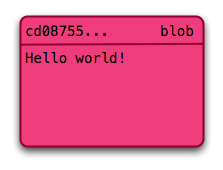

```bash
$ git cat-file -p cd08755
Hello world!
```

- Seul le **contenu** est enregistré, le nom et l'emplacement du fichier ne sont pas disponibles

Notes :


## Tree

- Puisque seul le contenu est conservé il faut un système pour réassigner celui-ci à un fichier. Cela se fera avec un **tree**

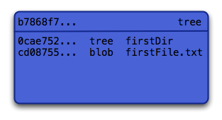

```bash
$ tree
|- firstDir
| |- firstFileCopy.txt
| `- secondFile.txt
`- firstFile.txt
$ git cat-file -p b7868f7
040000 tree 0cae752... firstDir
100644 blob cd08755... firstFile.txt
```

Notes :


## Tree

- Un tree contient des références vers des blobs ainsi que d'autres trees pour créer un système hiérarchique
- Cette fois-ci seul les noms des "fichiers/dossiers" sont enregistrés
- Le SHA1 associé est celui qui permet d'accéder au blob/tree correspondant
- PS : Il ne peut pas exister de "dossier" (tree) vide !

Notes :


## Exemple d'arborescence

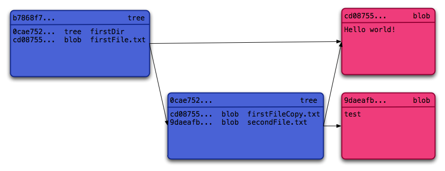

- Note : Il n'y a qu'un seul blob contenant "Hello world !"
- Même contenu => même SHA1

Notes :


## Commit

- Il ne manque plus qu'à obtenir les informations différenciant les versions des données. Les **commits**

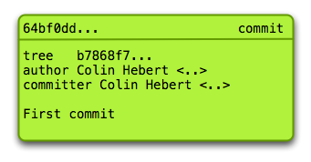

```bash
$ git cat-file -p 64bf0dd
Tree b7868f7...
Author Zenika <training@zenika.com> 1308746088 +0100
Committer Zenika <training@zenika.com> 1308746088 +0100

First commit
```

Notes :


## Commit

- Un commit contenant les méta-données d'une sauvegarde
  - Auteur, Timestamp, Tree servant de racine, message de commit

- Il y a une différence entre l'auteur et le commiteur (utile en OSS)
  - Auteur : a écrit le patch/la version actuelle
  - Commiteur : a validé le patch et avait les droits suffisants pour le mettre sur le dépôt

Notes :


## Plein de commits

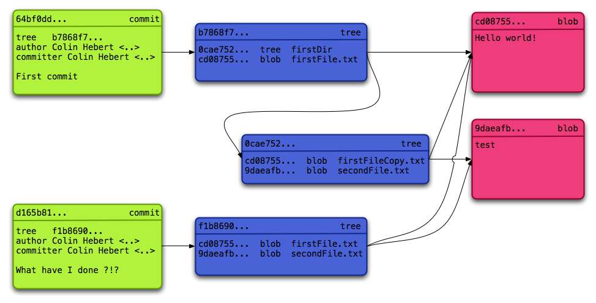

- Une petite explication de ce graphe ?

Notes :


## L'oeuf et la poule

- En ayant plusieurs commits, il reste encore le problème de l'**ordre** des commits
- Pour ça un attribut **parent** est placé dans chaque commit, pointant sur le(s) commit(s) précédent(s)
  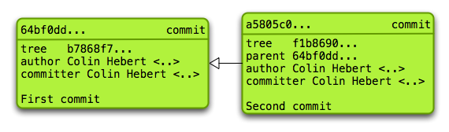

- Contrairement à d'autres VCS l'ordre de parution des commits n'influe pas sur l'ordre réel des commits
- Chaque commit sait d'où il "vient", mais ne sait pas vers où il "va"
  - Il pourrait y avoir plusieurs branches (ou aucune)
  - Quand le commit est fait, il n'y a pas de commit suivant !

Notes :


## Les branches

- Un concept important, parfois évité par les utilisateurs d'anciens VCS, est remis au goût du jour : les **branches**
- Certains VCS se basent sur le principe qu'une branche n'est qu'un dossier dans lequel on recopie tout l'ancien projet
  - L'historique n'est pas/plus accessible
  - Le changement de branche signifie qu'il faut tout re-télécharger
  - Il est quasi impossible de retracer l'avancement d'une branche sur une période
  - Beaucoup de développeurs préfèrent se risquer à commiter du code "sale" au lieu de passer par l'enfer de la gestion des branches

Notes :


## Les branches "proprement"

- À la base les branches sont simples, ce sont des commits pointant vers un même parent
  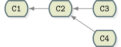
- Ce système permet d'avoir deux branches totalement indépendantes. *C3* et *C4* n'ont strictement aucun lien entre eux
  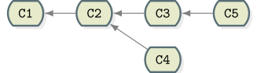
- *C5* n'est pas après *C4* même si chronologiquement les commits se suivent

Notes :


## Les merges

- Les branches ne sont que des commits distincts (non successifs) sur un graphe
- Merger signifie simplement créer un commit regroupant les deux (ou plus) branches
  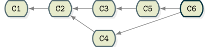
- Une réponse simple à un concept simple
- Des outils vont automatiser le merge et résoudre la plupart des conflits
- Attention cependant, il faudra en résoudre certains soi-même, manuellement

Notes :


## Cas "amusant"

- Les commits successifs *C1*, *C2*, *C3* sont créés
- *C4* est une branche de *C2* et *C5* est le commit suivant *C4*
- Comment merger les deux branches sans merger le contenu de *C5* qui est un commit instable (ou non intéressant)

- Ce genre de cas est quasiment ingérable avec certains VCS, pourtant la solution est très simple
  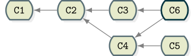

Notes :


## Installation & Qui suis-je ?

- Git est
 - un logiciel de DVCS open-source, multi-plateforme et gratuit
 - disponible sur http://git-scm.com/
 - basé sur les principes vus jusqu'à présent


- Après installation, un nom d'utilisateur et un email de contact doivent être configurés (et seront associés aux commits)

```bash
$ git config --global user.name "Zenika"
$ git config --global user.email "training@zenika.com"
```

Notes :


## Travailler avec ses outils

- Pour la gestion de certains messages et éditions, Git va automatiquement appeler un éditeur de texte
- Par défaut celui pointé par la variable d'environnement `EDITOR` sera choisi
- Pour spécifier un autre éditeur
```bash
git config --global core.editor "notepad.exe"
```

- Certains éditeurs sont conseillés
  - Windows : notepad.exe notepad++.exe
  - Linux/UNIX : vi, emacs, nano
  - Mac OS : textmate


Notes :


## Initialiser un projet

- Une fois que Git est installé et configuré il ne reste plus qu'à démarrer un projet
- En ligne de commande, `git init` créera un dossier versionné sous Git

```bash
$ git init resaroute
Initialized empty Git repository in /home/user/resaroute/.git/
```

- Le dossier `.git` créé sera le lieu où toutes les données et configurations seront stockées en interne
  - Il n'y a qu'un seul et unique dossier `.git` pour tout le projet
  - Au fur et à mesure, le contenu de ce dossier sera analysé en détails

Notes :


## Trouver de l'aide

- En cas de problème, il est possible de se référer à la documentation Git via `git help <command>` ou `man git-command`
- La documentation est aussi disponible http://git-scm.com/docs
  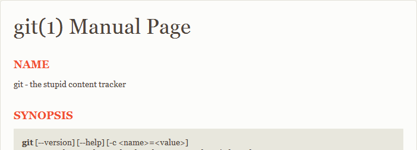
- La mailing list <git@vger.kernel.org> permet de résoudre la plupart des problèmes techniques et bugs liés à Git
- La page http://git-scm.com/documentation liste les ressources les plus pertinentes dans le domaine

Notes :


<!-- .slide: class="page-questions" -->


<!-- .slide: class="page-tp1" -->
