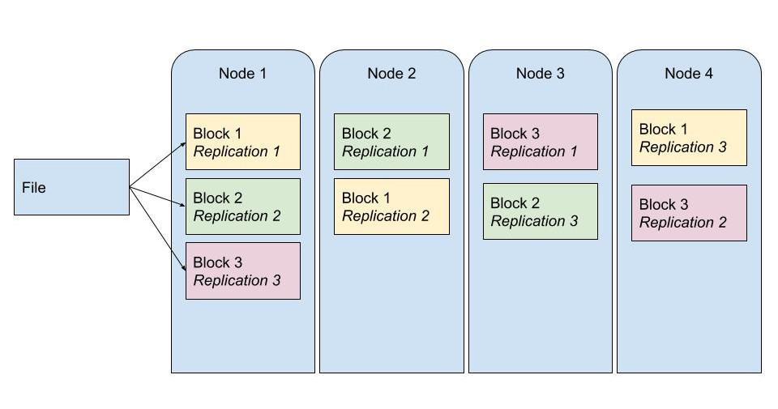
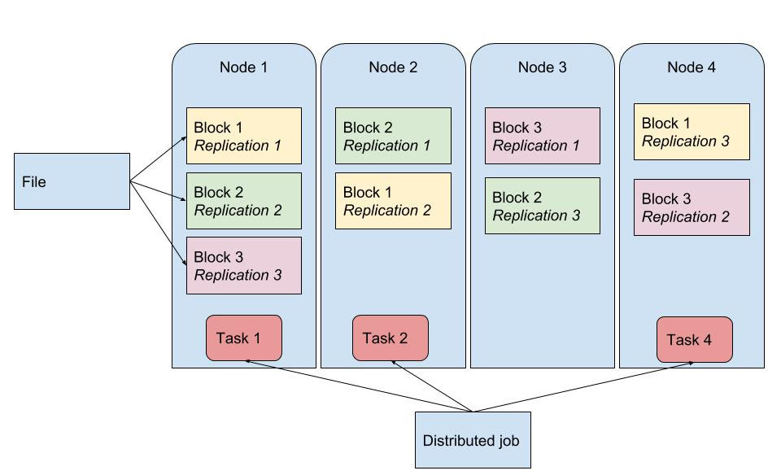
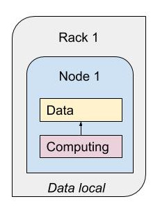
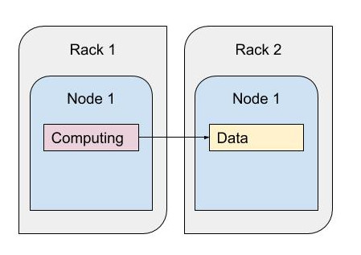
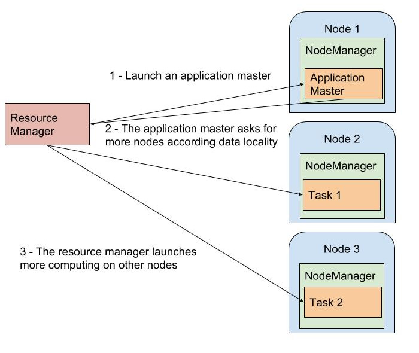

# Système distibué

<!-- .slide: class="page-title" -->

## Plan

<!-- .slide: class="toc" -->

- [Introduction](#/1)
- **[Système distribué](#/2)**
- [Cluster et gestionnaires de cluster](#/3)
- [Calcul distribué : Spark en action](#/4)
- [Tour des outils du monde de la data](#/5)
- [RGPD](#/6)

## Système distribué

- **Stockage distribué**
- Calcul distribué
- Négociateur de ressources

# Stockage distribué

<!-- .slide: class="page-title" -->

## Une autre solution

>> “In pioneer days they used oxen for heavy
   pulling, and when one ox couldn’t budge a
   log, we didn’t try to grow a larger ox. We
   shouldn’t be trying for bigger computers,
   but for more systems of computers.”

>> —Grace Hopper

## Principes

- Tolérant aux pannes
- Scalable horizontalement
- Synchronisation
- Disponible
- Complexité non visible

## Notion de fichiers distribués
<figure>
      
</figure>

## Notion de racks

<figure>
      
</figure>

## HDFS (suite Hadoop)

<figure>
      
</figure>

## DataLake (Lac de données)
>>  Un lac de données (en anglais data lake) est une méthode de stockage des données utilisée par le big data (mégadonnées en français). Ces données sont gardées dans leurs formats originaux ou sont très peu (**Wikipedia**)

*Centralisation*

## Focus HDFS : lire dossiers

`hdfs dfs -ls`

 

`hdfs dfs -ls /user`

    

*Notion d'utilisateur HDFS*

## Focus HDFS : lire fichier

`hdfs dfs -less exemple/test`

 

`hdfs dfs -tail exemple/test`

## Focus HDFS : récupérer fichier

`hdfs dfs -get exemple/test`

## Focus HDFS : créer dossier

`hdfs dfs -mkdir exemple`

## Focus HDFS : ajouter fichier

`hdfs dfs -put test exemple/`

# TP 1 : HDFS

<!-- .slide: class="page-title" -->

## Système distribué

- Stockage distribué
- **Calcul distribué**
- Négociateur de ressources

# Calcul distribué

<!-- .slide: class="page-title" -->

## Un programme distribué

- Hadoop Map Reduce
- Spark

 
*Capacité à distribuer le travail*

## Tâches distribuées

<figure>
      
</figure>

## Tâches distribuées en rapport avec la donnée

<figure>
      
</figure>

## Data locality

<figure>
      
</figure>

## Data local

<figure>
      
</figure>

## Intra rack

<figure>
      
</figure>

## Inter rack

<figure>
      
</figure>

## Système distribué

- Stockage distribué
- Calcul distribué
- **Négociateur de ressources**

# Négociateur de ressources

<!-- .slide: class="page-title" -->

## Qu'est-ce qui est négocié ?
- CPU
- RAM
- Data locality

## Exemple avec YARN (suite Hadoop)

<figure>
      
</figure>

## YARN + HDFS

<figure>
      
</figure>

## Hadoop Map Reduce en action avec YARN pour la data locality

<figure>
      
</figure>

## Commandes YARN

` yarn logs -applicationId <application ID>`

<!-- .slide: class="page-questions" -->
