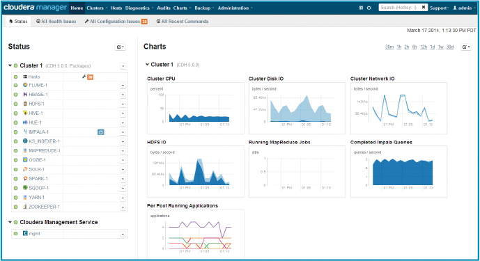
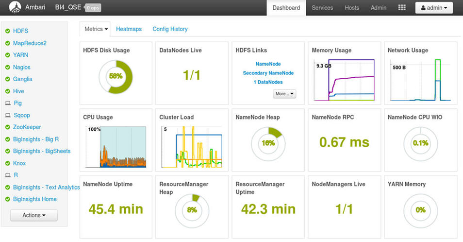
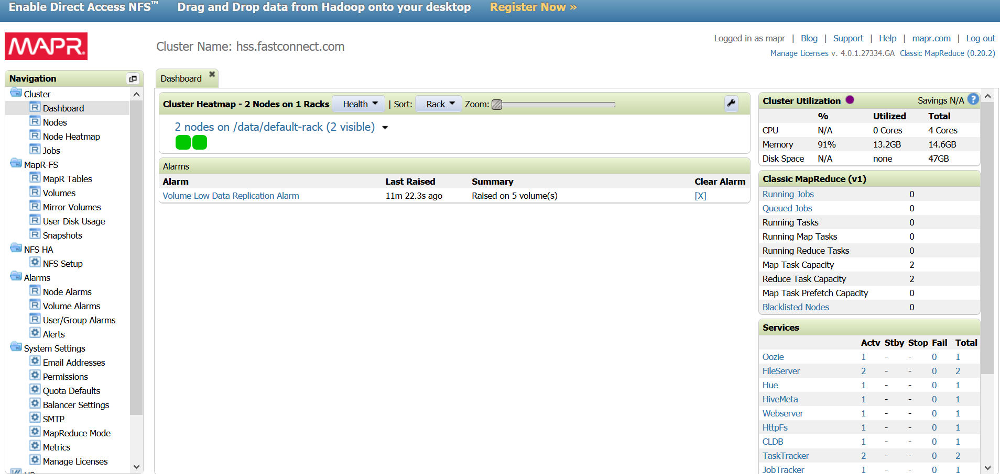

# Cluster et gestionnaires de cluster 

<!-- .slide: class="page-title" -->

## Plan

<!-- .slide: class="toc" -->

- [Introduction](#/1)
- [Système distribué](#/2)
- **[Cluster et gestionnaires de cluster](#/3)**
- [Calcul distribué : Spark en action](#/4)
- [Tour des outils du monde de la data](#/5)
- [RGPD](#/6)

## Cluster et gestionnaires de cluster

- **Définitions**
- Les solutions du marché

# Définitions

<!-- .slide: class="page-title" -->

## Définition : Grappe de serveurs

>> On parle de grappe de serveurs , de cluster, ou de ferme de calcul (computer cluster en anglais) pour désigner des techniques consistant à regrouper plusieurs ordinateurs indépendants appelés nœuds (node en anglais) (**Wikipedia**)

## Plusieurs architectures

Système distribué

<figure>
      
</figure>

## Des outils Hadoop

- YARN : négociateur de ressources
- HDFS : fichiers distribués
- MapReduce : calcul distribué

## Des outils plus généralement

- YARN
- HDFS et/ou Kafka
- MapReduce et/ou Spark

## Des outils qui gravitent autour

- Hive
- Sqoop

## Cluster et gestionnaires de cluster

- Définitions
- **Les solutions du marché**

## Un gestionnaire de cluster

- Plus facile d'installer
- Plus facile de maintenir
- Centralisation
- Dashboards

## Cloudera

<figure>
      
</figure>

## Hortonworks avec Ambari

<figure>
      
</figure>

## MapR 

<figure>
      
</figure>

## Fusion

<figure>
      
</figure>

## Notions

- Noeuds
- Rôles
- Dashboard
- Etats de santé

# TP 2 : Prendre en main Ambari

<!-- .slide: class="page-title" -->

<!-- .slide: class="page-questions" -->
