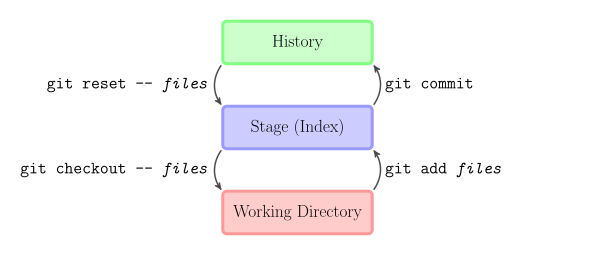

# Utiliser Git en local

<!-- .slide: class="page-title" -->


## Plan

<!-- .slide: class="toc" -->

- [Introduction](#/1)
- [Fonctionnement de Git](#/2)
- **[Utiliser Git en local](#/3)**
- [Les références](#/4)
- [Utiliser Git en distant](#/5)
- [Configuration et outils externes](#/6)

Notes :


## Étapes lors d'une sauvegarde

- Le système de sauvegarde de version par Git repose sur le maintien d'un objet "tree" temporaire et la validation de celui-ci lors de la création du commit
- Cet "arbre temporaire" est appelé l'index, la staging area ou encore le cache et contient toutes les informations en préparation d'un commit


- Étapes de création du commit
  - Création/Modification/Suppression de contenu
  - Insertion des changements dans l'index
  - Validation de l'index dans l'état actuel et création de l'objet commit

Notes :


## Working/Index/Stored

- Les trois différentes zones où se situe le contenu sont donc
  - Working directory
  - Index (stage)
  - Base interne de Git



Notes :

TODO : Corriger ce graphique :
- le checkout récupère le contenu de stored vers working
- le reset peut impacter le working


## État de l'index

- `git status` permet d'observer l'état actuel de l'index
  - Les éléments ajoutés/supprimés/modifiés
  - Les éléments non versionnés

- Cette commande permet d'observer rapidement toutes les actions qui ont été réalisées et qui n'ont pas encore été commitées

```bash
$ git status
On branch master
Initial commit
nothing to commit (create/copy files and use "git add" to track)
$ echo "test" > newFile.txt
$ git status
On branch master
Initial commit
Untracked files:
  (use "git add <file>..." to include in what will be committed)
    newFile.txt
nothing added to commit but untracked files present (use "git add" to track)
```

Notes :


## Ajouter/modifier des éléments

- Ajouter ou modifier un élément signifie
  - Mettre le nouveau contenu dans la "base interne" de Git (blob)
  - Modifier l'index afin d'avoir un tree à jour pour un futur commit
- Afin de simplifier ces deux opérations, une seule commande suffit, `git add`

```text
git add [-A] [-i] [-e] [<file-pattern ...>]

  -A Ajoute tous les éléments non-versionnés et modifiés à l'index
  -i Lance l'ajout des éléments en mode interactif
  -e Ouvre un éditeur pour modifier l'élément avant qu'il ne soit versionné
  <file-pattern ...>
     Fichiers à prendre en compte lors de l'ajout à l'index
     Les Fileglobs sont autorisés
```

- Après ajout via `git add`, les nouveaux blobs ont étés ajoutés en base, et le tree est prêt à être commité ou remodifié

Notes :


## git add

- D'abord les contenus sont modifiés/créés

```bash
$ echo "test" >> newFile.txt; echo "test" >> firstFile.txt
$ git status
On branch master
Changes not staged for commit:
  (use "git add <file>..." to update what will be committed)
  (use "git checkout -- <file>..." to discard changes in working directory)
    modified: firstFile.txt
Untracked files:
  (use "git add <file>..." to include in what will be committed)
    newFile.txt
no changes added to commit (use "git add" and/or "git commit -a")
```

- Un simple appel à `git add` ajoute toutes les informations dans l'index

```bash
$ git add -A
$ git status
On branch master
Changes to be committed:
  (use "git reset HEAD <file>..." to unstage)
    modified: firstFile.txt
    new file: newFile.txt
```

Notes :

Montrer ici l'apparition du fichier d'index dans le dossier .git


## git add en mode interactif

- Une autre façon de faire consiste à passer par le mode interactif

```bash
$ git add -i
           staged            unstaged path
  1:    unchanged               +1/-0 firstFile.txt

*** Commands ***
1: status   2: update    3: revert    4: add untracked
5: patch    6: diff      7: quit      8: help
What now>
```

- Le mode interactif permet une utilisation avancée
  - Ajout partiel de contenu
  - Génération de patchs
  - Annulation de modifications
  - Détail des modifications effectuées
- Le tout avec une application en ligne de commande détaillée

Notes :


## Suppression de contenu

- La suppression de contenu permet de retirer au fur et à mesure le contenu versionné devenu inutile
  - Supprimer un contenu ne supprime pas les anciennes versions de celui-ci, mais l'enlève uniquement pour les prochaines versions
- La commande de suppression est `git rm`, elle se charge aussi de supprimer le fichier du disque dur si celui-ci est encore présent

```text
git rm [-r] [--cached] [<file-pattern ...>]

  -r Supprime les dossiers (trees) récursivement
  --cached Supprime le contenu de l'index uniquement
    et ne touche pas aux fichiers/dossiers
  <file-pattern ...>
    Fichiers à prendre en compte lors de la suppression de l'index
    Les Fileglobs sont autorisés
```

Notes :


## git rm

- La suppression est très simple, les fichiers déjà supprimés sont signalés dans le `git status`

```bash
$ rm secondFile.txt
$ git status
On branch master
Changes to be committed:
  (use "git reset HEAD <file>..." to unstage)

    modified: firstFile.txt
    new file: newFile.txt

Changes not staged for commit:
  (use "git add/rm <file>..." to update what will be committed)
  (use "git checkout -- <file>..." to discard changes in working directory)

    deleted: secondFile.txt
```

Notes :


## git rm

- La suppression de l'index et du fichier si nécessaire

```bash
$ git rm secondFile.txt
rm 'secondFile.txt'
$ git status
On branch master
Changes to be committed:
  (use "git reset HEAD <file>..." to unstage)

    modified: firstFile.txt
    new file: newFile.txt
    deleted: secondFile.txt
```

Notes :


## Visualisation des modifications

- `git diff` permet d'afficher les modifications au format textuel diff unifié

```text
git diff [--cached] [<commit1> [<commit2>]] [<file-pattern ...>]

  --cached
    Permet de comparer l'index par rapport au dépôt
  <commit1>
    Commit à partir duquel comparer
  <commit2>
    Commit avec lequel comparer (par défaut le commit courant)
  <file-pattern ...>
    Fichiers à comparer
    Les Fileglobs sont autorisés
```

- Par défaut Git compare le contenu du working directory avec celui de l'index

Notes :


## git diff

- Les modifications entre l'index et le dépôt

```diff
$ git diff --cached
diff --git a/firstFile.txt b/firstFile.txt
index 980a0d5..36310c8 100644
--- a/firstFile.txt
+++ b/firstFile.txt
@@ -1 +1 @@
-Hello World!
+Hello people!
```

- Les modifications entre le working directory et l'index

```diff
$ git diff
diff --git a/firstFile.txt b/firstFile.txt
index 36310c8..e26f92a 100644
--- a/firstFile.txt
+++ b/firstFile.txt
@@ -1 +1,2 @@
 Hello people!
+Goodby people!
```

Notes :


## Validation de l'index et commit

- Une fois l'index modifié et acceptable pour une sauvegarde, il ne reste plus qu'à l'enregistrer grâce à un commit
- La commande `git commit` s'occupe de cette étape

```text
git commit [-a|--interactive] [-v] [--amend] [-m <msg>]

  -a Ajoute tous les contenus modifiés/supprimés à l'index avant le commit
  --interactive
    Lance le mode interactif de git add avant le commit
  -v Mode verbeux, affiche un diff avant de valider le commit
  --amend
    Supprime le commit précédent et le remplace par le courant
    Le message de commit sera initialisé au message précédent
    Pratique lorsque l'on s'est trompé lors d'un commit
  -m <msg>
    Message à utiliser lors du commit. Si aucun message n'est fourni
    Git essayera d'ouvrir un éditeur de texte pour recevoir un message de commit
    Outre le fait qu'il soit recommandé, par défaut il n'est pas
    possible de commiter sans message
```

Notes :


## git commit

- L'appel de `git commit` avec l'option `-m` permet de tout faire en une seule ligne de commande

```bash
$ git commit -m "A relevant message"
[master 7cc6ab3] A relevant message
 3 files changed, 2 insertions(+), 1 deletions(-)
 create mode 100644 newFile.txt
 delete mode 100644 secondFile.txt
$ git status
On branch master
nothing to commit, working directory clean
```

- Bien sûr, après un commit, l'index est complètement neuf et correspond exactement au contenu du dernier commit
- Attention : En équipe ou seul, avoir des messages de commit pertinents est important pour potentiellement revenir sur d'anciennes sauvegardes

Notes :

Montrer ici le contenu du dossier .git/objects et faire des cat-file sur les SHA1


## Des commits et des messages

- Au fur et à mesure, une norme s'est installée au sein des messages
- Celle-ci veut que chaque message respecte le format suivant
  - Titre : Simple concis et en moins de 50 caractères et écrit au présent
  - Contenu : Un texte plus long contenant un détail des opérations effectuées et leurs raisons. Dans le cas de l'utilisation d'un bug tracker le numéro du bug corrigé
- Les deux points étant séparés par une ligne vide
- Ce format vient du format des mails, avec objet et contenu
- http://bit.ly/goodcommitmessages


Notes :


## Voir l'historique

- La commande `git log` permet de lister, chercher et formater les commits selon certains critères

```text
git log [-<n>] [--pretty[=<format>]] [--abbrev-commit] [--oneline]
        [--graph] [--all|<since>..<until>] [<path>...]

  -<n>
    Liste n commits uniquement
  --pretty[=<format>]
    Formate la sortie sous les formes oneline, short, full, fuller,
    medium (par défaut), email, raw ou format:<string>
  --abbrev-commit
    Affiche les identifiants de commits en raccourci
  --oneline
    Raccourci pour "--pretty=oneline --abbrev-commit"
  --graph
    Affiche le log sous forme de graphe vertical
  --all
    Affiche les logs de toutes les branches
  <since>..<until>
    Affiche les commits entre since et until (voir références)
  <path>...
    Affiche les commits ayant modifié les différents path
```

Notes :


## git log

- Par défaut `git log` peut être un peu verbeux

```bash
$ git log
commit 7cc6ab3e0d5c85af382fb9b82e1f6f78daf5381c
Author: Zenika <training@zenika.com>
Date:   Wed Jul 13 15:23:58 2011 +0100

    A relevant message

commit a5805c0b83691d5dd0937840094522bd9b795bc8
Author: Zenika <training@zenika.com>
Date:   Wed Jun 22 17:20:32 2011 +0100

    Second commit
```

- Les options de formatage permettent d'avoir des informations plus précises, tout en éludant les données inutiles

```bash
$ git log --oneline
7cc6ab3 A relevant messagea
5805c0 Second commit
64bf0dd First commit
```

Notes :


## Voir l'historique d'un fichier

- La commande `git blame` permet de voir le dernier commit ayant modifié chaque ligne d'un fichier

```text
git blame [<rev>] <file>

  <rev>
    Annote le fichier au commit rev
  <file>
    Annote le fichier file
```

```bash
$ git blame README
df185d44 (Zenika 2011-07-21 22:06:38 +0200 1) Première ligne modifiée
0f56dae4 (Alex   2011-07-19 18:45:27 +0200 2) Deuxième ligne
0f56dae4 (Alex   2011-07-19 18:45:27 +0200 3) Et troisième ligne
6dc66b44 (Colin  2011-07-22 10:17:53 +0200 4) Dernière ligne
```

Notes :


## Restaurer une sauvegarde

- La commande `git checkout` permet de revenir à l'état de n'importe quel commit effectué

```text
git checkout <commit>

  <commit>
    Identifiant ou référence vers le commit à restaurer
```

- Il est possible après avoir restauré un commit *C2* d'en créer un nouveau appelé *C4* se basant sur *C2*


Notes :


## git checkout

- Pour voir les effets d'un `git checkout` il suffit de regarder le contenu avant

```bash
$ ls
FirstFile.txt newFile.txt
$ git log --oneline
7cc6ab3 A relevant message
a5805c0 Second commit
64bf0dd First commit
```

- Et après

```bash
$ git checkout a5805c0
Note: checking out 'a5805c0'.
You are in 'detached HEAD' state. You can look around, make experimental changes and commit them, and you can discard any commits you make in this state without impacting any branches by performing another checkout.
If you want to create a new branch to retain commits you create, you may do so (now or later) by using -b with the checkout command again. Example:
    git checkout -b new_branch_name
HEAD is now at a5805c0... Second Commit
$ ls
FirstFile.txt secondFile.txt
```

Notes :


<!-- .slide: class="page-questions" -->


<!-- .slide: class="page-tp2" -->

