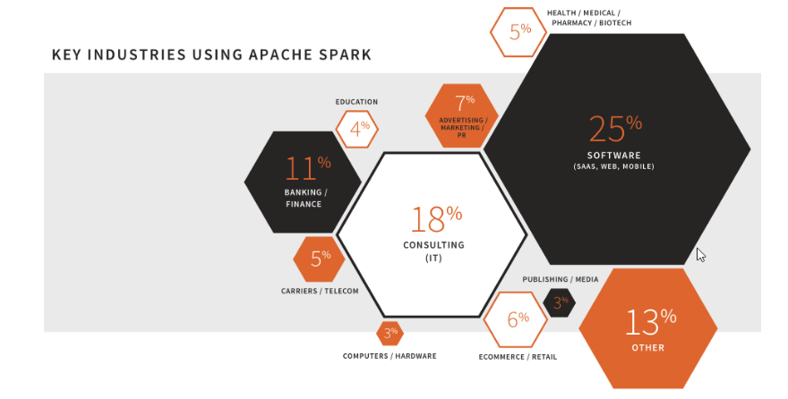
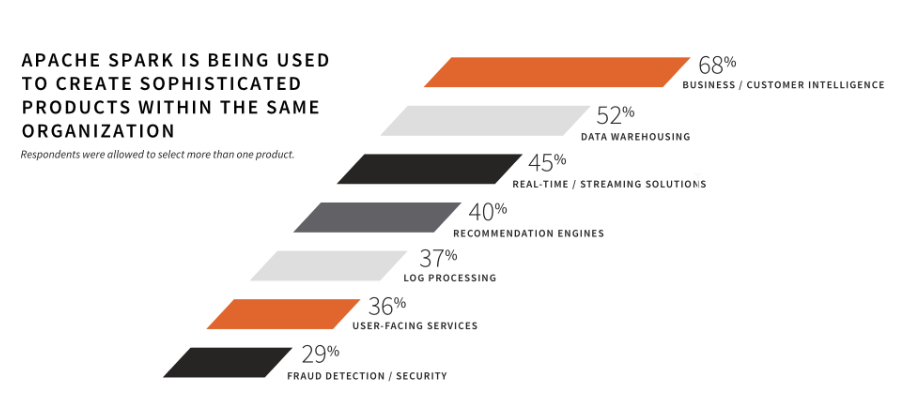
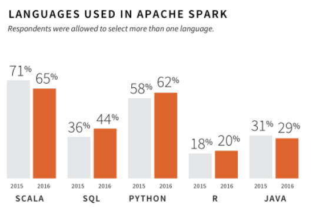

# Calcul distribué : Spark en action

<!-- .slide: class="page-title" -->


## Plan

<!-- .slide: class="toc" -->

- [Introduction](#/1)
- [Système distribué](#/2)
- [Cluster et gestionnaires de cluster](#/3)
- **[Calcul distribué : Spark en action](#/4)**
- [Tour des outils du monde de la data](#/5)
- [RGPD](#/6)


## Calcul distribué : Spark en action

- **Qu'est-ce que Spark ?**
- Lire un fichier avec Spark
- Effectuer des transformations
- Ecrire un fichier depuis Spark dans HDFS


# Qu'est-ce que Spark ?

<!-- .slide: class="page-title" -->


## En 3 mots

- Calcul distribué
- Open source
- Scala


## Historique

- 2009 : Projet étudiant
- 2010 : Project open-sourcé
- 2013 : Devient un projet Apache, création de Databricks
- 2014 : Top Level project Apache, projet le plus actif au sein de la fondation Apache (500+ contributeurs)
- 2014 : Release de Spark 1.0, 1.1 et 1.2
- 2015 : Release de Spark 1.3, 1.4, 1.5 et 1.6
- 2015 : IBM, SAP… investissent dans Spark
- 2015 : 2000 participants au Spark Summit SF, 1000 au Spark Summit Amsterdam
- 2016 : Spark Summit à San Francisco
- 2016 : Release de Spark 2.0


## Pourquoi Spark ?

- Offrir des cas d'usage que Hadoop MapReduce ne peut traiter 
- Rapidité (utilisation de la RAM)
- Être developper-friendly


## Qui utilise Spark ?

<figure>
      
</figure>


## Pourquoi faire ?

<figure>
      
</figure>


## Différents langages 

<figure>
      
</figure>


## Calcul distribué : Spark en action

- Qu'est-ce que Spark ?
- **Lire un fichier avec Spark**
- Effectuer des transformations
- Ecrire un fichier depuis Spark dans HDFS


# Lire un fichier avec Spark

<!-- .slide: class="page-title" -->


## Lire un fichier CSV

```scala

val diamonds = spark.
                  read.
                  option("header", "true"). 
                  option("inferSchema", "true").
                  csv("diamonds.csv") 
                  
diamonds.show(5)

+---+-----+---------+-----+-------+-----+-----+-----+----+----+----+
|_c0|carat|      cut|color|clarity|depth|table|price|   x|   y|   z|
+---+-----+---------+-----+-------+-----+-----+-----+----+----+----+
|  1| 0.23|    Ideal|    E|    SI2| 61.5|   55|  326|3.95|3.98|2.43|
|  2| 0.21|  Premium|    E|    SI1| 59.8|   61|  326|3.89|3.84|2.31|
|  3| 0.23|     Good|    E|    VS1| 56.9|   65|  327|4.05|4.07|2.31|
|  4| 0.29|  Premium|    I|    VS2| 62.4|   58|  334| 4.2|4.23|2.63|
|  5| 0.31|     Good|    J|    SI2| 63.3|   58|  335|4.34|4.35|2.75|
+---+-----+---------+-----+-------+-----+-----+-----+----+----+----+

```


## Imprimer le schéma

```scala
diamonds.printSchema

root
 |-- _c0: integer (nullable = true)
 |-- carat: double (nullable = true)
 |-- cut: string (nullable = true)
 |-- color: string (nullable = true)
 |-- clarity: string (nullable = true)
 |-- depth: double (nullable = true)
 |-- table: double (nullable = true)
 |-- price: integer (nullable = true)
 |-- x: double (nullable = true)
 |-- y: double (nullable = true)
 |-- z: double (nullable = true)
```


## Lire un fichier json

```scala
val people = spark.read.json("people.json")
people.show

+----+-------+
| age|   name|
+----+-------+
|null|Michael|
|  30|   Andy|
|  19| Justin|
+----+-------+

```


# TP 3 : Lire un fichier avec Spark

<!-- .slide: class="page-title" -->


## Calcul distribué : Spark en action

- Qu'est-ce que Spark ?
- Lire un fichier avec Spark
- **Effectuer des transformations**
- Ecrire un fichier depuis Spark dans HDFS


# Effectuer des transformations

<!-- .slide: class="page-title" -->


## Créer une table dans Spark

```scala

people.createOrReplaceTempView("people")

spark.sql("""
select * from people
""").show

+----+-------+
| age|   name|
+----+-------+
|null|Michael|
|  30|   Andy|
|  19| Justin|
+----+-------+
```


## Filtrer

```scala
val filteredPeople = spark.sql("""
select * from people where age > 20
""")

filteredPeople.show

+---+----+
|age|name|
+---+----+
| 30|Andy|
+---+----+
```


## Sélectionner
```scala
spark.sql("""
select name from people where age > 20
""").show

+----+
|name|
+----+
|Andy|
+----+
```


## Réaliser quelques statistiques 

```scala
spark.sql("""
select max(age), min(age), round(avg(age))
from people
""").show

+--------+--------+------------------+
|max(age)|min(age)|round(avg(age), 0)|
+--------+--------+------------------+
|      30|      19|              25.0|
+--------+--------+------------------+
```


## Réaliser quelques statistiques par un élément

```scala
spark.sql("""
select max(price), min(price) color
from diamonds
group by color
""").show

+----------+----------+-----+
|max(price)|min(price)|color|
+----------+----------+-----+
|     18791|       342|    F|
|     18731|       326|    E|
|     18693|       357|    D|
|     18710|       335|    J|
|     18818|       354|    G|
|     18823|       334|    I|
|     18803|       337|    H|
+----------+----------+-----+
```


## Renommer des champs 

```scala
spark.sql("""
select max(age) as max_age, min(age) as min_age, round(avg(age) as avg_age)
from people
""").show

+--------+--------+-------+
|max_age |min_age |avg_age|
+--------+--------+-------+
|      30|      19|   25.0|
+--------+--------+-------+
```


# TP 4 : Effectuer des transformations avec Spark

<!-- .slide: class="page-title" -->


## Calcul distribué : Spark en action

- Qu'est-ce que Spark ?
- Lire un fichier avec Spark
- Effectuer des transformations
- **Ecrire un fichier depuis Spark dans HDFS**


# Ecrire un fichier depuis Spark dans HDFS

<!-- .slide: class="page-title" -->


## Ecrire en parquet

```scala
result.write.parquet("path")
```


## Lire du parquet

```scala
spark.read.parquet("path")
```


# TP 5 : Ecrire un fichier avec Spark

<!-- .slide: class="page-title" -->


<!-- .slide: class="page-questions" -->
