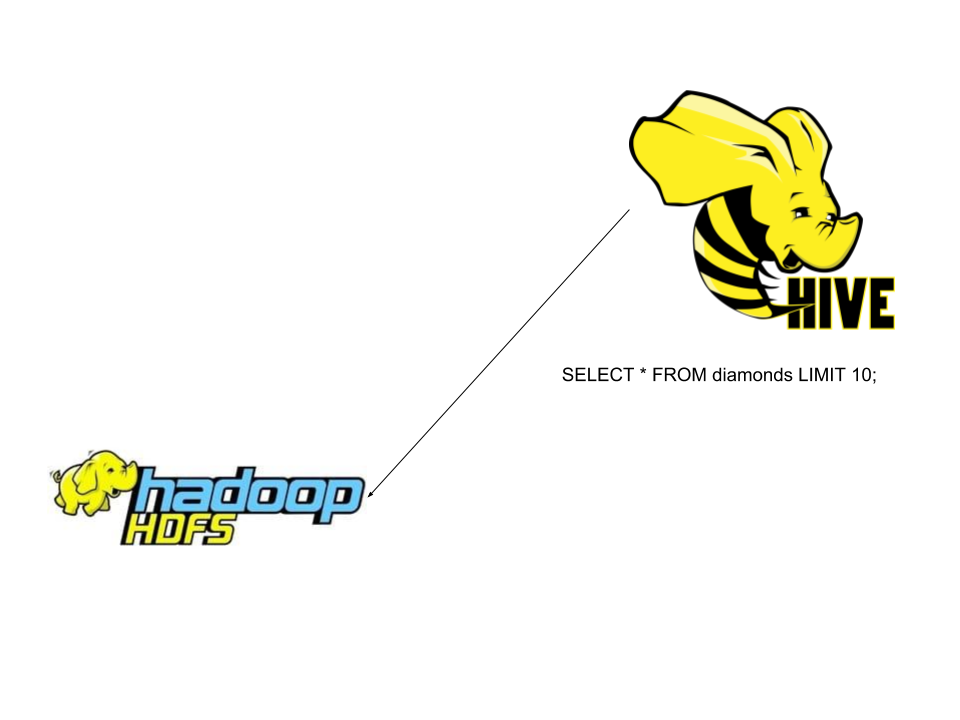
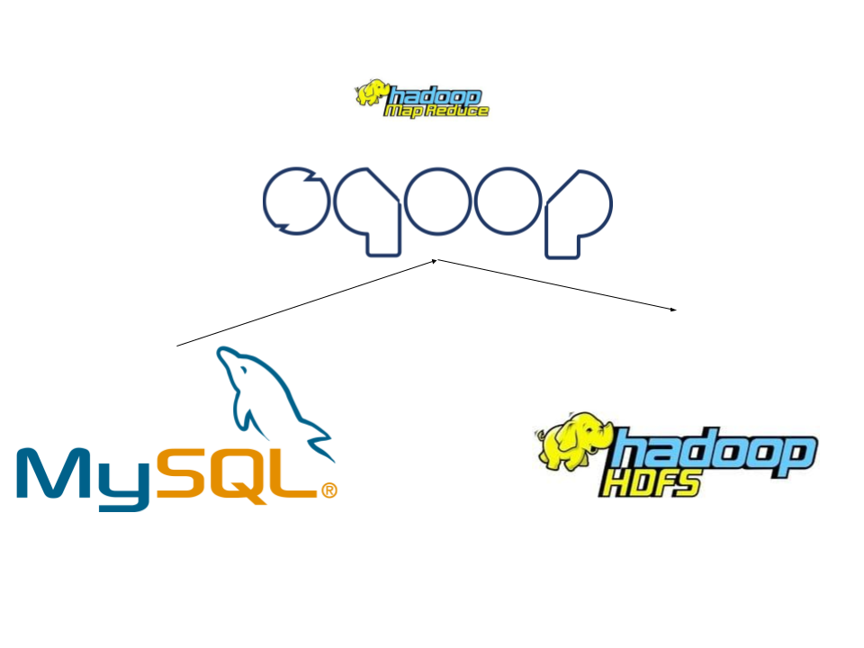
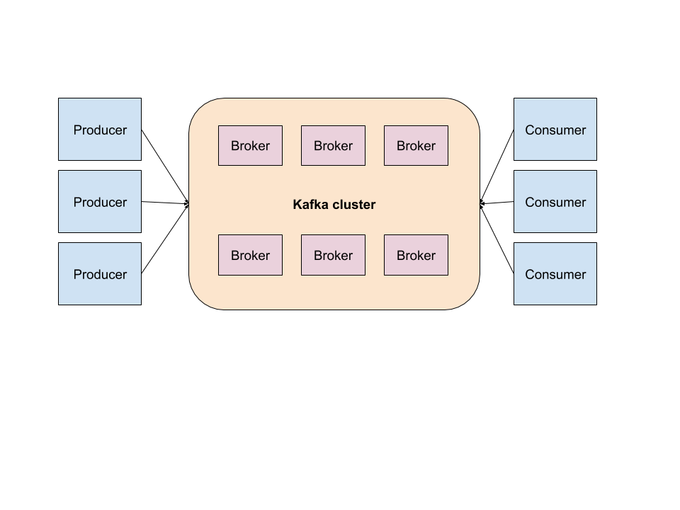

# Tour des outils du monde de la data

<!-- .slide: class="page-title" -->


## Plan

<!-- .slide: class="toc" -->

- [Introduction](#/1)
- [Système distribué](#/2)
- [Cluster et gestionnaires de cluster](#/3)
- [Calcul distribué : Spark en action](#/4)
- **[Tour des outils du monde de la data](#/5)**
- [RGPD](#/6)


## Tour des outils du monde de la data

- **Hive**
- Sqoop
- Kafka


# Hive

<!-- .slide: class="page-title" -->


## Hive pour requêter les données en SQL

<figure>
      
</figure>


## Créer une table avec Hive

```sql
CREATE TABLE people (
name STRING,
age INT
)
STORED AS PARQUET
LOCATION "path"
```


## Faire des requêtes dans Hive

```sql
hive > select * from people
```


# TP 7 : Hive

<!-- .slide: class="page-title" -->


## Tour des outils du monde de la data

- Hive
- **Sqoop**
- Kafka


# Sqoop

<!-- .slide: class="page-title" -->


## Sqoop : de l'ingestion avec MapReduce
<figure>
      
</figure>


## Sqoop import

```
sqoop import \
  --connect jdbc:mysql://ms.itversity.com:3306/retail_db \
  --username retail_user \
  --password itversity \
  --table order_items \
  --target-dir /user/dgadiraju/sqoop_import/retail_db/order_items
```


## Sqoop : choisir les colonnes

```
sqoop import \
  --connect jdbc:mysql://ms.itversity.com:3306/retail_db \
  --username retail_user \
  --password itversity \
  --table order_items \
  --columns order_item_order_id,order_item_id,order_item_subtotal \
  --target-dir /user/dgadiraju/sqoop_import/retail_db/order_items
```


## Sqoop : avec une requête

```
sqoop import \
  --connect jdbc:mysql://ms.itversity.com:3306/retail_db \
  --username retail_user \
  --password itversity \
  --target-dir /user/dgadiraju/sqoop_import/retail_db/orders_with_revenue \
  --query "select o.*, sum(oi.order_item_subtotal) order_revenue from orders o join order_items oi on o.order_id = oi.order_item_order_id and \$CONDITIONS group by o.order_id, o.order_date, o.order_customer_id, o.order_status"
```


# TP 8 : Sqoop

<!-- .slide: class="page-title" -->


## Tour des outils du monde de la data

- Hive
- Sqoop
- **Kafka**


# Kafka

<!-- .slide: class="page-title" -->


## Définition


>> Kafka est un système de messagerie distribué, originellement développé chez LinkedIn, et maintenu au sein de la fondation Apache depuis 2012 (**Xebia**)


## Schema

<figure>
      
</figure>


<!-- .slide: class="page-questions" -->
