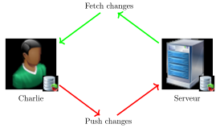

# Utiliser Git en distant

<!-- .slide: class="page-title" -->


## Plan

<!-- .slide: class="toc" -->

- [Introduction](#/1)
- [Fonctionnement de Git](#/2)
- [Utiliser Git en local](#/3)
- [Les références](#/4)
- **[Utiliser Git en distant](#/5)**
- [Configuration et outils externes](#/6)

Notes :


## Accès distant

- Les systèmes de VCS sont souvent synonymes d'échanges avec un dépôt distant
- Git possède cette capacité à se connecter vers un ou des dépôts pour échanger les différentes modifications qui ont eu lieu


- Les dépôts uniquement distants, peuvent être créés en `bare`
  - Accessibles depuis l'extérieur
  - Contiennent uniquement la base de données de Git

Notes :


## Types d'accès

- Les dépôts sont accessibles au travers de différents protocoles
  - File system : Utilisé jusqu'à présent, tout le monde ayant les droits en écriture sur le dossier peut de fait modifier le dépôt
  - SSH : Sécurisé et le plus commun, il permet de faire une gestion fine des droits d'accès en distant
  - git : Embarqué avec Git, similaire au SSH mais sans authentification
  - HTTP(s) : Protocole autorisé par la plupart des pare-feux, il est souvent utilisé en lecture seule pour publier un projet


Notes :


## Utilisation d'un dépôt distant

- Le système proposé par Git pour la gestion des dépôts distants fonctionne sur le modèle
  - Déclaration du dépôt (chemin d'accès + nom)
  - Récupération des données du dépôt
    - Branches
    - Tags
    - Objets Git non "dangling"
  - Envoi des nouvelles données, si les droits en écriture sont activés



Notes :


## Déclaration d'un dépôt externe

- La déclaration et gestion des dépôts externes se font grâce à `git remote`

```text
git remote [add|rm|show] <nom> [<url>]

  add
    Ajoute le dépôt "nom" pointant vers "url"
  rm
    Supprime le dépôt externe "nom" de la liste
  show
    Affiche les informations sur le dépôt "nom"
```

- Sans aucun argument, `git remote -v` affiche tous les dépôts enregistrés

Notes :


## Récupération des données

- Pour récupérer les données, `git fetch` est utilisé

```text
git fetch [--all|<nom>]

  --all
    Récupère les derniers ajouts sur tout les dépôts
  <nom>
    Récupère les derniers ajouts sur le dépôt "nom"
```

- Les informations récupérées sont uniquement les références disponibles ainsi que tous les commits associés
- Cette récupération ne nécessite pas de recharger tout le contenu du dépôt externe
- Aucune référence n'est modifiée en local, seuls de nouveaux objets sont ajoutés à la base locale

Notes :


## Récupération et incorporation

- Il est aussi possible de charger et incorporer directement les dernières modifications apportées sur une branche
- La commande pour ceci est `git pull`

```text
git pull [--rebase] <depot> <branche>

  --rebase
    Utilise la technique de rebase au lieu d'un merge
  <depot>
    Dépôt où sont situées les données
  <branche>
    Nom de la branche à récupérer et appliquer sur la branche courante
```

- La première action faite par `git pull` est la même que `git fetch`, les dernières modifications sont rapatriées
- Après cette récupération Git essaye de fusionner la-dite branche avec la branche actuelle (la copie de travail pointée par *HEAD*)


Notes :


## Envoi des nouveaux commits

- Pour partager le travail effectué, il est possible de passer par la commande `git push`

```text
git push [--all] <depot> [--delete] [[<brancheL>]:<brancheD>]

  --all
    Crée tous les éléments présents sur le dépôt local, sur le dépôt distant
  <depot>
    Dépôt externe où envoyer les données
  --delete
    Supprime la branche distante
  <brancheL>
    Nom de la branche local à envoyer sur le dépôt externe
  <brancheD>
    Nom de la branche distante
```

- Si la branche locale n'est pas spécifiée ou que l'option `--delete` est utilisée, la branche distante est supprimée : `git push --delete branchToDelete` ou `git push :branchToDelete`

Notes :


## Règles de bienséance

- Les possibilités de Git sont quasi-illimitées, seulement il persiste tout de même certaines règles à respecter
- Tout commit fait sur un dépôt public doit (dans la mesure du possible) être final
  - Pas de rebase
  - Pas de suppression de commit
  - Pas de suppression de branche non-fusionnée
  - Pas de modification/suppression de tag
  - Pas d'amendement sur les commits
- De base Git interdira de pusher des commits non *fast forward*
- Dans le cas où ceci serait fait, il faudrait en informer tous les développeurs afin que ceux-ci récupèrent les modifications et rebasent leur travail
- Les dépôts privés cependant ne nécessitent pas cette attention

Notes :


## Partage "manuel"

- Il est possible grâce à `git diff` et `git apply` de partager manuellement des patchs
- `git diff` permet de générer des patchs

```text
git diff <commit1> [<commit2>]

  <commit1> <commit2>
    Commits à comparer, commit2 est HEAD si non renseigné
```

- `git apply` applique un patch spécifié à la branche courante

```text
git apply <patch> [<patch ...>]

  <patch>
    Fichier contenant le patch à appliquer
```

- Attention : ce système peut être pratique ponctuellement mais risque de créer des conflits

Notes :


## Copie parfaite

- S'il est possible de créer un dépôt local, se brancher sur un dépôt externe, récupérer son contenu et ses références puis checkout son *HEAD*, Git propose une solution simple, `git clone`

```text
git clone <depot> [<dossier>]

  <depot>
    Dépôt externe à cloner
  <dossier>
    Dossier du projet à créer, par défaut ce sera le nom du dernier élément de l'URL du dépôt
```

- Git s'occupe donc de tous les appels qui auraient étés faits en temps normal
- Le remote par défaut s'appellera `origin`

Notes :


<!-- .slide: class="page-questions" -->


<!-- .slide: class="page-tp5" -->
