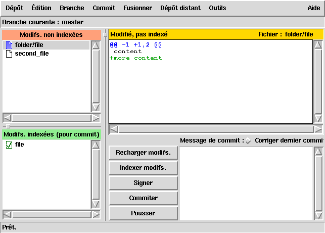
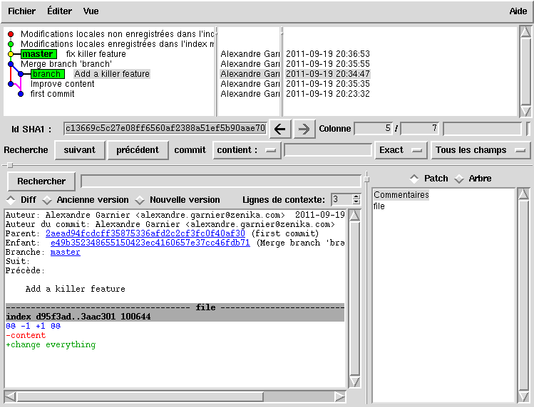
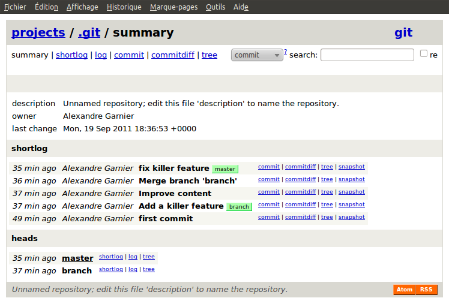

# Configuration et outils externes

<!-- .slide: class="page-title" -->


## Plan

<!-- .slide: class="toc" -->

- [Introduction](#/1)
- [Fonctionnement de Git](#/2)
- [Utiliser Git en local](#/3)
- [Les références](#/4)
- [Utiliser Git en distant](#/5)
- **[Configuration et outils externes](#/6)**

Notes :


## Configuration générale

- La configuration se fait avec la commande `git config`

```text
git config [--global] [--get] <option>

  --global
    Modifie ~/.gitconfig au lieu de .git/config
  --get
    Récupère la configuration au lieu de la modifier
  <option>
    Option à modifier
    Généralement sous la forme "groupe.option"
```

- Deux options ont déjà été créées plus tôt
  - `user.name`
  - `user.email`

- Attention les configurations ne sont pas partagées avec les autres dépôts

Notes :


## Les alias

- Il est possible de créer ses propres commandes Git
- Ces commandes peuvent-être des raccourcis vers des commandes Git existantes ou bien des scripts entiers
- La création d'un alias `a` consiste en l'ajout d'une configuration `alias.a` dans le fichier de configuration
- Par exemple la commande `git log --graph --oneline --decorate` utilisée pour visualiser les commits peut-être crée sous une forme plus succincte

```bash
$ git config --global alias.glog 'log --graph --oneline --decorate'
$ git glog
* b3d9655 (HEAD, tag: firstTag, remote/master, master) Merge branch 'secondBranch'
|\
| * dc1ce86 Foo bar modification
* | 7cc6ab3 A relevant message
* | a5805c0 Second commit
|/
* 64bf0dd First commit
```

Notes :

Montrer ici le contenu du dossier .git/config


## Ignorer des fichiers

- Certains fichiers ne sont peut-être pas à commiter
- Ce genre de cas est géré par les fichiers `.gitignore`
- Le contenu d'un fichier `.gitignore` est une liste de fichiers/patterns à ignorer lors de l'utilisation de Git
- Quelques règles sont à connaître :
  - `#` Permet de placer un commentaire
  - `*` Remplace une suite de lettres dans le nom du fichier
  - `?` Remplace une lettre dans le nom du fichier
  - `!` Permet d'annuler un ignore fait précédemment
  - `/` Au début du nom d'une ressource permet d'ignorer cette ressource uniquement depuis le dossier où se situe le `.gitignore`
  - `/` À la fin d'une ressource permet de ne s'appliquer qu'aux dossiers

Notes :


## Les hooks

- Il est possible d'imposer des règles à différents moments du cycle sous la forme de scripts exécutables
- Les hooks sont disponibles sur `.git/hooks`

- On différencie les hooks côté client :
  - `pre-commit` : déclenché avant le commit, permet de lancer des checkstyles
  - `commit-msg` : déclenché lors du commit, permet de vérifier le format du message de commit
- Des hooks côté serveur :
  - `update` : exécuté lors des push utilisateurs
  - `acl` : gère les autorisations des utilisateurs

Notes :


## Exemple de hook

Exemple de vérification de format : fichier `.git/hooks/update`

```ruby
$regex = /\[ref: (\d+)\]/

# vérification du format des messages de validation
def verif_format_message
  revs_manquees = `git rev-list #{$anciennerev}..#{$nouvellerev}`.split("\n")
  revs_manquees.each do |rev|
    message = `git cat-file commit #{rev} | sed '1,/^$/d'`
    if !$regex.match(message)
      puts "Le message de validation n'est pas conforme"
      exit 1
    end
  end
end

verif_format_message
```

Notes :


## Intégration SVN

- Git est utilisable comme client valide d'un serveur SVN avec les commandes de type `git svn`
- Avantages
  - Permet de profiter localement des avantages de Git
  - Passage progressif au fonctionnement de Git
- Désavantages
  - Version tronquée de Git
  - Préférable de garder une structure linéaire

Notes :


## Complétion/couleurs/éditeur

- Un fichier de complétion bash `git-completion.bash` est fourni dans l'installation de Git et permet compléter les commandes grâce à la touche *tab*, ZSH supporte la complétion par défaut
- La gestion des couleurs dans le terminal s'active grâce à la configuration de `color.ui`
- Il est possible de personnaliser l'éditeur utilisé par Git lors des commits via `core.editor`

Notes :


## GUI

- Git fournit une interface graphique par défaut : `git gui`



Notes :


## GUI

- `git-gui` permet en direct :
  - De voir l'état de l'arbre de travail
  - De voir l'état de l'index
  - De voir les différences de chaque fichier
  - De commiter

- Mais il permet aussi :
  - De gérer les branches
  - De gérer les dépôts distants
  - D'effectuer des merges

Notes :


## gitk

- Git fournit un autre outil graphique pour le parcours de l'historique : `gitk`



Notes :


## gitweb

- De même, il existe une interface web par défaut à Git : `gitweb`



Notes :


## gitweb

- Lancement rapide via `git instaweb`
- Par défaut : http://localhost:1234/
- S'intègre parfaitement avec les serveurs HTTP
- Permet de :
  - Parcourir plusieurs dépôts
  - Consulter l'historique
  - Accéder aux trees et blobs
  - Voir les diffs

Notes :


## Gerrit

- Gerrit est une interface web de relecture de code
- Il a été développé par Google dans le cadre du développement d'Android
- Le principe est le suivant :
  - Un développeur pousse ses modifications sur le dépôt Gerrit
  - D'autres développeurs peuvent visionner et commenter les modifications et les approuver ou non
  - Le développeur peut repousser des corrections si nécessaire
  - Une fois les modifications approuvées, celles-ci peuvent être intégrées dans le dépôt de confiance

Notes :


<!-- .slide: class="page-questions" -->


<!-- .slide: class="page-tp6" -->
